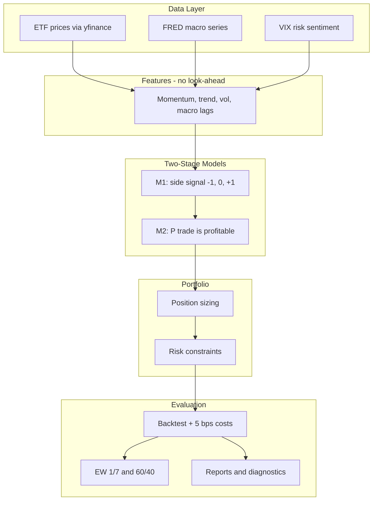
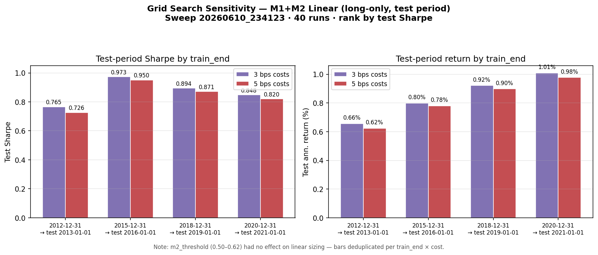

# Architecture Briefing — Multi-Asset Meta-Labeling Pipeline

**Audience:** Investment banking / systematic markets professionals  
**Purpose:** Explain project architecture, pipeline steps, and parameter choices  
**Disclaimer:** Research backtest only — not live trading or investment advice.

---

## One-Sentence Pitch

A weekly-rebalanced, seven-ETF global macro basket where a rule-based primary model proposes trades, a secondary classifier estimates trade quality, and a sizing layer turns that into portfolio weights—with strict chronological train/test discipline and institutional-style risk constraints.

---

## High-Level Flow



**Frequency:** Weekly (Friday close), rebalance weekly.  
**Universe:** SPY, TLT, GLD, VEA, VWO, HYG, VNQ — a compact multi-asset sleeve (equity, rates, credit, gold, REITs, EM/DM).

---

## The Three-Layer Decision Stack

| Layer | Question it answers | Output |
|--------|---------------------|--------|
| **M1** | Which side? | `+1` long, `-1` short, `0` flat per asset-week |
| **M2** | Is this M1 trade likely to pay? | `P(success)` — meta-label |
| **Sizing** | How much capital? | Scale weight by probability; apply caps |

**Why split M1 and M2?**  
In production quant shops, combining “direction” and “size” in one model often blurs signal quality. Meta-labeling lets M1 cast a wide net (opportunities) while M2 focuses on **false-positive control** and **capital efficiency**—a familiar split from systematic PM literature (e.g. López de Prado).

---

## Pipeline Stages

1. **Data ingest** — ETF prices + FRED macro (CPI, unemployment, industrial production, Fed funds, 10Y yield, curve, credit spread) + VIX. Cached parquet for repeat runs.

2. **Panel construction** — By default, only weeks where **all seven ETFs** have data (~2007 onward; VEA/HYG are the binding constraints). Optional partial-universe mode for earlier history.

3. **Feature engineering** — Per-asset factors: momentum (4/12/26/52w), trend, volatility, drawdown; cross-asset dispersion; macro with **4-week publication lag**; features shifted so nothing uses future data.

4. **Labels** — Forward **4-week** return; long success if return > 0.5% after a 0.1% cost hurdle; analogous for shorts.

5. **M1 (rule-based)** — Weighted score: momentum 45%, trend 25%, macro 20%, risk penalty 10%, plus asset-class macro tilts and relative momentum/carry-style features. Current default uses a **weekly top-3 cross-sectional allocator**: each Friday, rank the ETF universe and allocate to the best three names. Pipeline still runs two diagnostic modes: long-only and long/short.

6. **M2 (logistic regression)** — Trained only where M1 ≠ 0. Predicts whether the forward trade beats the cost hurdle. Default threshold 0.55; optional probability calibration.

7. **Position sizing** — M1 winners receive the full base budget by default (`conviction_sizing: false`); M2 variants then apply binary, linear, or ECDF probability sizing. Constraints: max 25% per asset, 100% gross exposure, ~1/7 base budget per name, 12% annualized volatility target.

8. **Backtest** — Weekly returns, turnover, **5 bps** transaction costs. Compared to equal-weight 1/7 and a stylized 60/40 ETF blend.

9. **Reports** — `PROJECT_SUMMARY.md` for branch-level context, `DATA_SOURCES_AND_ETL.md` for source/ETL review, `reports/final_report.md` plus charts for generated results, and grid search outputs for parameter experiments.

---

## Key Parameters and Rationale

### Train / test split

| Parameter | Default | Rationale |
|-----------|---------|-----------|
| `train_end` | 2020-12-31 | In-sample: threshold tuning, M2 fit, winsorization |
| `test_start` | 2021-01-01 | Out-of-sample: reported Sharpe, M2 precision/recall |
| `data_start` | 2000-01-01 | Extra history for rolling windows before train |

**Talking point:** We never shuffle time. M2 metrics and grid-search ranking use the test window only.

### M1 allocation

Momentum-heavy (45%) reflects trend persistence in ETF sleeves; macro (20%) adds regime context (rates, inflation, credit); risk penalty (10%) down-weights high-vol / stressed names. The current default is **top-K cross-sectional allocation** (`allocation_mode: top_k`, `top_k: 3`) rather than absolute score thresholds. This improved capital deployment while keeping the model interpretable.

Threshold tuning still exists (`allocation_mode: threshold`) and can optimize a portfolio-level objective, but it is not the current default.

### M2 threshold (0.55 default)

Higher → fewer trades in the **binary** M2 variant, often better precision and lower turnover. It does not affect **linear** M2 sizing because linear sizing uses continuous `P(success)` directly. This was an important grid-search insight.

### Labels: 4-week horizon, ±0.5% thresholds

Weekly rebalance with a **one-month** forward window is a practical holding-period assumption. Thresholds embed a minimal edge above noise; `transaction_cost_threshold` (0.1%) aligns M2 labels with frictional reality.

### Portfolio constraints

| Constraint | Value | Interpretation |
|------------|-------|----------------|
| `max_abs_asset_weight` | 25% | Single-name concentration limit |
| `max_gross_exposure` | 100% | No leverage in base config |
| `transaction_cost_bps` | 5 | Conservative round-trip friction for ETFs |
| `vol_target_ann` | 12% | Gross exposure scaling target for the active sleeve |

### Long-only vs long/short

The pipeline **always runs both**. Current evidence favors **long-only** as the production-like sleeve. Long/short is useful diagnostically, but shorts have generally reduced returns in this upward-drifting ETF sample.

---

## Benchmarks

- **Equal weight 1/7** — Naive diversified ETF basket; primary excess-return benchmark.
- **60/40-style ETF mix** — Stylized balanced reference (overweight bonds/credit vs gold).

Strategy variants: M1 only, M1+M2 (binary / linear / ECDF). Current discussion usually treats **M1-only** as the return-oriented sleeve and **M1+M2 ECDF** as the best risk-adjusted M1/M2 combination.

---

## Research Hygiene

1. **No look-ahead** — `shift(1)` on rolling features; macro lagged 4 weeks.
2. **Chronological split** — Train strictly before test.
3. **M1 thresholds fit on train only** — Not peeking at 2021+.
4. **M2 evaluated on test** — Confusion matrix, AUC, hit rates by M1 signal bucket.
5. **Reproducibility** — Config YAML, timestamped `runs/`, grid search snapshots per experiment.

**Caveat:** Data are **yfinance + FRED** (research-grade), not Bloomberg. Results are **historical simulation**, not live P&amp;L or capacity-adjusted institutional execution.

For a data-source and ETL audit, see `DATA_SOURCES_AND_ETL.md`.

---

## Current Branch Results and Interpretation

The latest branch state should be read as a **long-only tactical allocator** with an optional M2 risk-shaping layer. Metrics in this section are **full sample (train + test)** unless explicitly labeled otherwise.

| Strategy | Ann. Return | Sharpe | Max Drawdown | What it means |
|----------|------------:|-------:|-------------:|---------------|
| Equal weight 1/7 | 7.36% | 0.57 | -39.44% | Passive fully invested benchmark |
| **M1 only, long-only** | **7.32%** | **0.70** | **-21.00%** | Main return-oriented model; nearly benchmark return with much lower drawdown |
| M1 + M2 binary | 7.16% | 0.69 | -23.48% | Similar to M1; M2 threshold does not add much here |
| M1 + M2 linear | 1.80% | 0.84 | -5.44% | Very defensive; useful as a drawdown-control example, not main return sleeve |
| M1 + M2 ECDF | 6.51% | 0.91 | -18.80% | Best risk-adjusted balance |

Reviewer caveat: equal-weight is shown with 0 bps transaction costs, while strategy variants pay the configured 5 bps turnover cost. M1 average gross exposure is about 81%, so the result is best framed as similar return with materially lower drawdown and lower deployed risk, not as strong positive excess return.

The generated final report now includes separate portfolio-level test-period tables. On the 2021+ long-only test window, M1-only reports 8.40% annualized return / 0.79 Sharpe versus equal-weight at 7.34% / 0.69; M1+M2 ECDF reports 6.93% / 0.85.

### How to make sense of M1 + M2

The cleanest framing is:

```text
M1 = opportunity selector
M2 = exposure/risk shaper
Portfolio = risk-budget enforcement
```

M1 is now strong enough to stand on its own as the return-oriented sleeve. M2 should not be described as “beating M1 on return.” Instead, M2 trades some return for better control of volatility and drawdown. ECDF sizing is currently the most useful M2 variant because it keeps meaningful exposure while improving Sharpe. Linear sizing is too conservative for the main story.

### Methods tried and lessons

| Method | Outcome | Insight |
|--------|---------|---------|
| Absolute M1 thresholds | Too much cash, lower return | Good diagnostic mode, not best default |
| Top-3 cross-sectional M1 | Improved deployment | Relative ranking fits a seven-ETF sleeve better |
| M1 conviction sizing | Suppressed return | Score works better for selection than fine-grained sizing |
| 12% vol target | Improved return without breaking Sharpe | Prior defaults were under-deployed |
| Long/short mode | Underperformed long-only | Short-side needs separate research |
| M2 linear | High Sharpe, very low return | Drawdown tool, not return engine |
| M2 ECDF | Best risk-adjusted variant | Best current M1/M2 combination |

For a branch reviewer, the most important file is `PROJECT_SUMMARY.md`; it contains the latest compact narrative and experiment interpretation.

---

## Grid Search Findings (June 2026 Sweep)

**Sweep:** `runs/grid_search/20260610_234123/` — **40/40 runs succeeded** (~14 min, cached data).  
**Design:** 4 `train_end` × 5 `m2.threshold` × 2 `transaction_cost_bps`; `test_start` = day after `train_end`.  
**Ranking metric:** test-period Sharpe, **M1+M2 linear**, long-only.

**Version note:** this sweep was run before the current top-K / 12% vol-target / no-conviction M1 defaults. Treat it as historical sensitivity evidence, not as final hyperparameter proof for the current branch configuration.



### What moved the needle

| Factor | Effect |
|--------|--------|
| **`train_end`** | **Dominant.** Mean test Sharpe: 2012 → 0.75, **2015 → 0.96**, 2018 → 0.88, 2020 → 0.83. Earlier train end ⇒ longer OOS window (e.g. 2015 → test from 2016, ~10 years). |
| **`transaction_cost_bps`** | Secondary: 3 bps beats 5 bps by ~0.03 Sharpe on average. |
| **`m2.threshold` (0.50–0.62)** | **No effect** on ranked metric — linear sizing uses continuous `P(success)`, not the binary threshold. |

### Best run (`run_011`)

| Parameter | Value |
|-----------|--------|
| `train_end` / `test_start` | 2015-12-31 / 2016-01-01 |
| `transaction_cost_bps` | 3 |
| Test Sharpe (M1+M2 linear) | **0.973** |
| Test ann. return | 0.80% |
| M1-only test Sharpe | 0.83 → M2 improves risk-adjusted OOS, not raw return |

**Default split (train 2020, test 2021+):** test Sharpe ~**0.82–0.85**, test ann. return ~**1.0%** — higher recent return, shorter OOS window, slightly lower Sharpe than the 2015 split.

### Interpretation for the meeting

1. **Split design matters more than M2 threshold** in this sweep — be explicit about which train/test window you are quoting.
2. **M2 linear is a sizing / drawdown tool** on this run: full-sample ann. return ~0.8% vs equal-weight ~7.4%, but Sharpe ~0.87 and max DD ~-2% vs ~-39% for EW.
3. **ECDF sizing** reached full-sample Sharpe ~1.12 on the best run but was not the grid ranking target.
4. **Long/short** underperformed long-only on test (Sharpe ~0.41 vs ~0.97 on best config).
5. **M2 AUC ~0.54** on test — weak classifier; value is mostly exposure scaling, not trade filtering.

**Next sweep ideas:** rank on `m1_m2_binary` or ECDF if those are decision-relevant; add `sizing_mode` or `train_start` to the grid; drop redundant `m2.threshold` rows when ranking linear.

Full table: `runs/grid_search/20260610_234123/results.csv` · Top 10: `summary.md`

---

## Suggested 5-Minute Meeting Narrative

1. **Problem:** Multi-asset ETF allocation with separable direction vs. sizing decisions.
2. **Approach:** Meta-labeling — M1 proposes, M2 filters, sizing scales.
3. **Universe & frequency:** Seven liquid ETFs, weekly.
4. **Edge hypothesis:** Cross-sectional momentum/trend/macro ranks select the better ETFs; M2 improves risk allocation rather than raw alpha.
5. **Evidence:** Long-only M1 now nearly matches equal-weight return (7.32% vs 7.36%) with higher Sharpe (0.70 vs 0.57) and much lower drawdown (-21% vs -39%). M1+M2 ECDF gives the best risk-adjusted profile (Sharpe ~0.91).
6. **Limitations:** Research stack, simplified costs, no live OMS, no capacity/impact modeling, sample starts ~2007 for full seven-ETF universe.

---

## Production Next Steps (if asked)

- Institutional data (Bloomberg/Refinitiv), point-in-time macro, corporate actions.
- Walk-forward / purged cross-validation for top-K, volatility target, and M2 sizing mode.
- Capacity, market impact, and borrow costs for shorts.
- Separate short-side research instead of assuming long/short symmetry.
- Benchmark-relative overlay experiments if the objective becomes beating equal-weight return consistently.
- LLM features exist in the codebase but are **off by default**.

---

## Repo Map

| Area | Location |
|------|----------|
| Config / parameters | `config/config.yaml` |
| Orchestration | `src/run_pipeline.py` |
| M1 / M2 | `src/model_m1.py`, `src/model_m2.py` |
| Backtest | `src/backtest.py`, `src/portfolio.py` |
| Final write-up | `reports/final_report.md` |
| Parameter sweep | `scripts/grid_search.py` |
| Full specification | `docs/PROJECT_BRIEF.md` |
