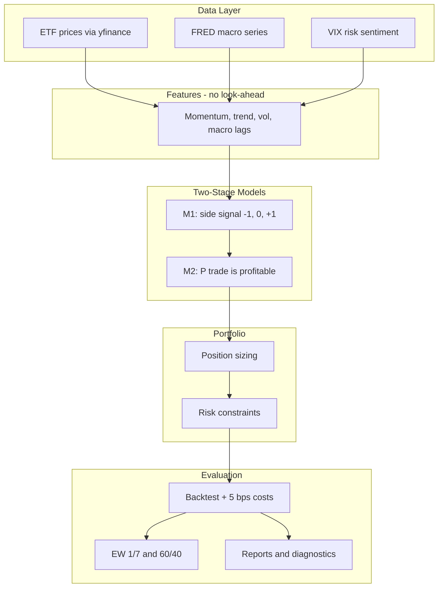

# Architecture Briefing — Multi-Asset Meta-Labeling Pipeline

**Audience:** Investment banking / systematic markets professionals  
**Purpose:** Explain project architecture, pipeline steps, and parameter choices  
**Disclaimer:** Research backtest only — not live trading or investment advice.

---

## One-Sentence Pitch

A weekly-rebalanced, seven-ETF global macro basket where a rule-based primary model proposes trades, a secondary classifier estimates trade quality, and a sizing layer turns that into portfolio weights—with strict chronological train/test discipline and institutional-style risk constraints.

---

## High-Level Flow

**Frequency:** Weekly (Friday close), rebalance weekly.  
**Universe:** SPY, TLT, GLD, VEA, VWO, HYG, VNQ — a compact multi-asset sleeve (equity, rates, credit, gold, REITs, EM/DM).

---

## The Three-Layer Decision Stack

| Layer | Question it answers | Output |
|--------|---------------------|--------|
| **M1** | Which side? | `+1` long, `-1` short, `0` flat per asset-week |
| **M2** | Is this M1 trade likely to pay? | `P(success)` — meta-label |
| **Sizing** | How much capital? | Scale weight by probability; apply caps |

**Why split M1 and M2?**  
In production quant shops, combining “direction” and “size” in one model often blurs signal quality. Meta-labeling lets M1 cast a wide net (opportunities) while M2 focuses on **false-positive control** and **capital efficiency**—a familiar split from systematic PM literature (e.g. López de Prado).

---

## Pipeline Stages

1. **Data ingest** — ETF prices + FRED macro (CPI, unemployment, industrial production, Fed funds, 10Y yield, curve, credit spread) + VIX. Cached parquet for repeat runs.

2. **Panel construction** — By default, only weeks where **all seven ETFs** have data (~2007 onward; VEA/HYG are the binding constraints). Optional partial-universe mode for earlier history.

3. **Feature engineering** — Per-asset factors: momentum (4/12/26/52w), trend, volatility, drawdown; cross-asset dispersion; macro with **4-week publication lag**; features shifted so nothing uses future data.

4. **Labels** — Forward **4-week** return; long success if return > 0.5% after a 0.1% cost hurdle; analogous for shorts.

5. **M1 (rule-based)** — Weighted score: momentum 45%, trend 25%, macro 20%, risk penalty 10%, plus optional asset-class macro tilts. Thresholds tuned **on train only** (quantile search). Pipeline runs **two modes**: long-only and long/short.

6. **M2 (logistic regression)** — Trained only where M1 ≠ 0. Predicts whether the forward trade beats the cost hurdle. Default threshold 0.55; optional probability calibration.

7. **Position sizing** — Binary, linear, or ECDF mapping from `P(success)` to size. Constraints: max 25% per asset, 100% gross exposure, ~1/7 base budget per name.

8. **Backtest** — Weekly returns, turnover, **5 bps** transaction costs. Compared to equal-weight 1/7 and a stylized 60/40 ETF blend.

9. **Reports** — `reports/final_report.md` plus charts; grid search can sweep 40 parameter combos and rank by **out-of-sample** Sharpe.

---

## Key Parameters and Rationale

### Train / test split

| Parameter | Default | Rationale |
|-----------|---------|-----------|
| `train_end` | 2020-12-31 | In-sample: threshold tuning, M2 fit, winsorization |
| `test_start` | 2021-01-01 | Out-of-sample: reported Sharpe, M2 precision/recall |
| `data_start` | 2000-01-01 | Extra history for rolling windows before train |

**Talking point:** We never shuffle time. M2 metrics and grid-search ranking use the test window only.

### M1 weights

Momentum-heavy (45%) reflects trend persistence in ETF sleeves; macro (20%) adds regime context (rates, inflation, credit); risk penalty (10%) down-weights high-vol / stressed names. Thresholds are **data-driven on train**, not hand-picked for full-sample fit.

### M2 threshold (0.55 default)

Higher → fewer trades, often better precision, lower turnover. Grid search sweeps 0.50–0.62. Classic **precision vs. activity** tradeoff.

### Labels: 4-week horizon, ±0.5% thresholds

Weekly rebalance with a **one-month** forward window is a practical holding-period assumption. Thresholds embed a minimal edge above noise; `transaction_cost_threshold` (0.1%) aligns M2 labels with frictional reality.

### Portfolio constraints

| Constraint | Value | Interpretation |
|------------|-------|----------------|
| `max_abs_asset_weight` | 25% | Single-name concentration limit |
| `max_gross_exposure` | 100% | No leverage in base config |
| `transaction_cost_bps` | 5 | Conservative round-trip friction for ETFs |

### Long-only vs long/short

The pipeline **always runs both**. Long-only avoids short exposure in upward ETF samples; long/short tests whether shorts add value. Reports show shorts often hurt M1 returns while M2 correctly rejects most short proposals.

---

## Benchmarks

- **Equal weight 1/7** — Naive diversified ETF basket; primary excess-return benchmark.
- **60/40-style ETF mix** — Stylized balanced reference (overweight bonds/credit vs gold).

Strategy variants: M1 only, M1+M2 (binary / linear / ECDF). **Linear M1+M2** is usually the main “production-like” variant in discussion.

---

## Research Hygiene

1. **No look-ahead** — `shift(1)` on rolling features; macro lagged 4 weeks.
2. **Chronological split** — Train strictly before test.
3. **M1 thresholds fit on train only** — Not peeking at 2021+.
4. **M2 evaluated on test** — Confusion matrix, AUC, hit rates by M1 signal bucket.
5. **Reproducibility** — Config YAML, timestamped `runs/`, grid search snapshots per experiment.

**Caveat:** Data are **yfinance + FRED** (research-grade), not Bloomberg. Results are **historical simulation**, not live P&amp;L or capacity-adjusted institutional execution.

---

## Suggested 5-Minute Meeting Narrative

1. **Problem:** Multi-asset ETF allocation with separable direction vs. sizing decisions.
2. **Approach:** Meta-labeling — M1 proposes, M2 filters, sizing scales.
3. **Universe & frequency:** Seven liquid ETFs, weekly.
4. **Edge hypothesis:** Momentum + trend + macro regimes, with M2 reducing false positives.
5. **Evidence:** Compare long-only vs long/short; test-period Sharpe; grid search over train-end and M2 threshold.
6. **Limitations:** Research stack, simplified costs, no live OMS, sample starts ~2007 for full universe.

---

## Production Next Steps (if asked)

- Institutional data (Bloomberg/Refinitiv), point-in-time macro, corporate actions.
- Walk-forward / purged cross-validation for hyperparameters.
- Capacity, market impact, and borrow costs for shorts.
- Risk parity or volatility targeting on top of meta-label sizes.
- LLM features exist in the codebase but are **off by default**.

---

## Repo Map

| Area | Location |
|------|----------|
| Config / parameters | `config/config.yaml` |
| Orchestration | `src/run_pipeline.py` |
| M1 / M2 | `src/model_m1.py`, `src/model_m2.py` |
| Backtest | `src/backtest.py`, `src/portfolio.py` |
| Final write-up | `reports/final_report.md` |
| Parameter sweep | `scripts/grid_search.py` |
| Full specification | `docs/PROJECT_BRIEF.md` |
