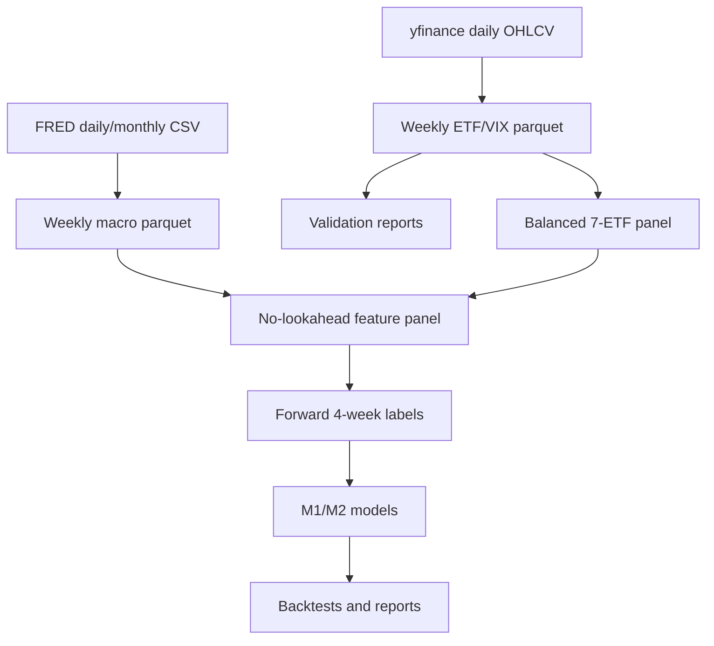

# Data Sources and ETL Review Notes

This note is intended for reviewers who want to audit the data provenance, ETL process, and no-lookahead controls behind the multi-asset meta-labeling pipeline.

## Data Sources

### Tradable Market Data

| Input | Source | Used for | Notes |
| --- | --- | --- | --- |
| `SPY` | yfinance | U.S. equity ETF proxy | Tradable component |
| `TLT` | yfinance | Long-duration Treasury ETF proxy | Tradable component |
| `GLD` | yfinance | Gold ETF proxy | Tradable component |
| `VEA` | yfinance | Developed ex-U.S. equity ETF proxy | Tradable component |
| `VWO` | yfinance | Emerging market equity ETF proxy | Tradable component |
| `HYG` | yfinance | High-yield credit ETF proxy | Tradable component |
| `VNQ` | yfinance | U.S. REIT ETF proxy | Tradable component |
| `^VIX` | yfinance | Risk sentiment feature | Not traded |

The market provider requests daily OHLCV data with `auto_adjust=False`, keeps `Adj Close`, and then resamples to weekly Friday frequency.

Primary implementation: `src/data_providers.py`

### Macro Data

| Input | Source | Used for |
| --- | --- | --- |
| `CPIAUCSL` | FRED public CSV | Inflation regime |
| `UNRATE` | FRED public CSV | Labor market regime |
| `INDPRO` | FRED public CSV | Growth regime |
| `FEDFUNDS` | FRED public CSV | Monetary policy |
| `DGS10` | FRED public CSV | Rate level / carry proxy |
| `T10Y2Y` | FRED public CSV | Yield curve regime |
| `BAA10Y` | FRED public CSV | Credit stress |

Macro series are used only as features. They are **not traded**. In feature engineering, macro data are forward-filled to weekly frequency and lagged by `features.macro_lag_weeks` (currently 4 weeks) to reduce publication-timing look-ahead risk.

## ETL Flow



### 1. Ingest

- Market data are downloaded through `YFinanceProvider.get_prices()`.
- Macro data are downloaded through `FredProvider.get_macro()`.
- Daily market data are saved to `data/raw/market_daily.parquet`.
- Weekly market data are saved to `data/processed/market_weekly.parquet`.
- Daily macro data are saved to `data/raw/macro_daily.parquet`.
- Weekly macro data are saved to `data/processed/macro_weekly.parquet`.

### 2. Resampling

Market data are resampled to `W-FRI`:

- `open`: first daily open in the week
- `high`: max daily high in the week
- `low`: min daily low in the week
- `close`: last daily close in the week
- `adj_close`: last daily adjusted close in the week
- `volume`: weekly sum

Macro data are resampled to `W-FRI` using the last available value in the week.

### 3. Cache and Refresh Behavior

The pipeline uses cached parquet files by default for reproducibility and speed. It automatically refreshes if the requested `data_start` materially predates cached market history.

Important detail: if `data_start` is a calendar date like `2000-01-01`, the first weekly Friday may naturally be `2000-01-07`; this is accepted and does not trigger a repeated refresh loop.

When FRED fetches partially fail during refresh:

1. Existing cached rows for missing macro series are preserved when available.
2. If no cached rows exist and market data are available, the pipeline fills missing macro series with market-derived proxy values.
3. This behavior is logged as a warning.

This fallback keeps the pipeline runnable, but proxy-filled macro values should be treated as **research fallback data**, not institutional point-in-time macro history.

### 4. Panel Construction

Default mode is a balanced full-universe panel:

```yaml
split.require_full_universe: true
```

That means a weekly row is kept only if all seven ETFs have data. Because `VEA` and `HYG` are younger ETFs, the full-universe effective start is around 2007 even though `data_start` is 2000.

Partial-universe mode exists:

```bash
python -m src.run_pipeline --partial-universe
```

Use it only when the research question explicitly allows a changing universe.

### 5. Validation

Validation writes run-specific files under `runs/<timestamp>/`:

- `validation_report.json`
- `ticker_coverage.csv`
- `model_panel_validation.json`

Validation checks include:

- Required columns
- Positive adjusted prices
- Required tickers present
- No duplicate date/ticker pairs
- No future-dated rows
- Balanced panel check when `require_full_universe=true`
- Numeric feature checks in the model panel

### 6. Feature Engineering and No-Lookahead Controls

Feature construction is in `src/feature_engineering.py`.

Controls:

- Momentum features use `pct_change(window).shift(1)`.
- Trend, volatility, drawdown, correlation, dispersion features are shifted so they are known at signal time.
- Macro data are forward-filled, then shifted by 4 weeks.
- Winsorization bounds are estimated on the train period and applied to the full panel.
- Labels are forward returns and are excluded from feature columns used by M1/M2.

## Reviewer Caveats

These are the main points a quantitative reviewer may challenge:

1. **Data vendor quality** — yfinance and public FRED are appropriate for research, but not production-grade. Bloomberg/Refinitiv or point-in-time vendor data would be needed for institutional claims.
2. **Adjusted-close assumptions** — the backtest uses adjusted close from yfinance. Corporate action handling is delegated to the vendor.
3. **Macro publication timing** — a 4-week macro lag is conservative but not true point-in-time release-calendar modeling.
4. **Proxy macro fallback** — when FRED partially fails, proxy macro series can be generated from market data. This is documented and logged, but should not be presented as real macro history.
5. **Balanced universe start** — the full seven-ETF universe starts later than `data_start`; this is expected because some ETFs did not exist in 2000.
6. **Transaction costs** — the default 5 bps cost is simplified and does not model market impact, borrow costs, tax, or capacity.
7. **Research tuning** — some parameter choices were guided by branch experiments. More robust validation would require walk-forward or purged cross-validation.

## Current Data State

As of the latest run:

- Market cache starts: `2000-01-07`
- Macro cache starts: `2000-01-07`
- Full balanced modeling panel starts: `2007-07-27`
- Full balanced modeling panel ends: `2026-06-12`

## Files to Inspect

| Area | File |
| --- | --- |
| Data providers | `src/data_providers.py` |
| Validation | `src/data_validation.py` |
| Feature engineering | `src/feature_engineering.py` |
| Label construction | `src/labels.py` |
| Pipeline orchestration | `src/run_pipeline.py` |
| Current final report | `reports/final_report.md` |
| Asset/source report | `reports/assets/asset_component_analysis.md` |
| Branch summary | `PROJECT_SUMMARY.md` |
