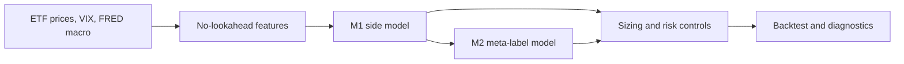

# Project Summary — Multi-Asset Meta-Labeling Pipeline

This branch contains a research-grade Python pipeline for a weekly, seven-ETF multi-asset allocation strategy. It is built around a two-stage meta-labeling design:

1. **M1** decides the trade side: long, short, or flat.
2. **M2** estimates whether an M1 trade is likely to be profitable.
3. **Portfolio sizing** turns M1/M2 outputs into ETF weights under exposure and cost constraints.

The project is for **research and education only**. It is not live trading infrastructure or investment advice.

## Current State

The current best production-like interpretation is the **long-only** sleeve. Long/short is still run for research comparison, but shorts have generally hurt results in this ETF universe. The headline metrics below are **full sample (train + test)** unless explicitly labeled otherwise.

| Strategy | Ann. Return | Sharpe | Max Drawdown | Interpretation |
| --- | ---: | ---: | ---: | --- |
| Equal Weight 1/7 | 7.36% | 0.57 | -39.44% | Fully invested passive benchmark |
| **M1 Only, long-only** | **7.32%** | **0.70** | **-21.00%** | Nearly benchmark return with much lower drawdown |
| M1 + M2 Binary | 7.16% | 0.69 | -23.48% | M2 threshold filter, similar return/risk to M1 |
| M1 + M2 Linear | 1.80% | 0.84 | -5.44% | Very defensive sizing; high Sharpe but too little return |
| M1 + M2 ECDF | 6.51% | 0.91 | -18.80% | Best risk-adjusted variant with meaningful return |

Main takeaway: **M1 is now close to equal-weight on return while improving Sharpe and cutting drawdown roughly in half. M2 is most useful as a sizing/risk layer, especially through ECDF sizing, rather than as a pure alpha generator.**

Reviewer caveat: the equal-weight benchmark is shown with 0 bps transaction costs, while strategy variants pay the configured 5 bps turnover cost. M1's average gross exposure is about 81%, not 100%, so the result should be framed as similar return with lower deployed risk and drawdown, not as strong positive excess return.

The generated final report now separates **full-sample** and **test-period** portfolio metrics. On the 2021+ long-only test window, M1-only reports 8.40% annualized return / 0.79 Sharpe versus equal-weight at 7.34% / 0.69; M1+M2 ECDF reports 6.93% / 0.85.

## How the Pipeline Works



### Data

- Tradable ETFs: `SPY`, `TLT`, `GLD`, `VEA`, `VWO`, `HYG`, `VNQ`
- Risk/macro inputs: VIX and FRED series (`CPIAUCSL`, `UNRATE`, `INDPRO`, `FEDFUNDS`, `DGS10`, `T10Y2Y`, `BAA10Y`)
- Frequency: weekly Friday close
- Default full-universe effective start: around 2007 because `VEA` and `HYG` are the youngest ETFs
- Cache behavior: if requested `data_start` materially predates cached data, the pipeline refreshes automatically

### M1

M1 is the primary side model. It scores each ETF each week using:

- Momentum and relative momentum
- Trend
- Volatility and drawdown penalty
- Asset-class macro tilts
- Macro/carry-style features

Current default M1 behavior:

- `allocation_mode: top_k`
- `top_k: 3`
- `allow_short: false` in the primary long-only sleeve
- `conviction_sizing: false`
- `portfolio.vol_target_ann: 0.12`

The important practical change is that M1 no longer tries to be active on every ETF. It selects the top-ranked names each week and applies a volatility budget. Disabling M1 conviction down-scaling improved return materially because the score already acts as a selector; further scaling was over-suppressing selected trades.

### M2

M2 is a logistic regression meta-labeling model trained only on non-zero M1 trades. It predicts:

```text
P(M1 trade is profitable over the forward 4-week label horizon)
```

M2 is not currently a strong standalone classifier. Its value is better understood as **risk and exposure shaping**:

- **Binary M2** keeps/rejects trades using a probability threshold.
- **Linear M2** scales size as `max(0, 2p - 1)`, creating very low exposure and low drawdown.
- **ECDF M2** ranks probabilities relative to training history and has produced the best risk-adjusted balance.

In current results, M2 ECDF gives lower return than M1-only but a much better Sharpe and lower drawdown. M2 linear has high Sharpe but return is too low to be the main strategy.

## Methods Tried and Insights

### 1. Long-only vs long/short

The pipeline always runs both modes. The consistent insight is that **long-only is superior** for this ETF sample. Long/short adds activity, but short timing is weak in an upward-drifting multi-asset ETF universe.

Current long/short M1-only return is much lower than long-only, even though drawdown can be lower. Treat long/short as a diagnostic experiment, not the main investment story.

### 2. M1 threshold model vs top-K allocator

Earlier M1 logic used absolute score thresholds. This was conservative and left too much capital in cash. The branch now defaults to a weekly top-K cross-sectional allocator:

```text
Each week, rank ETFs by M1 score and allocate to the top 3 names.
```

Insight: top-K better matches the problem. In a seven-asset sleeve, relative ranking is more useful than asking whether each score clears a fixed absolute level.

### 3. M1 conviction sizing

Conviction sizing mapped M1 score magnitude into `[0, 1]` and multiplied the base weight. This seemed reasonable, but experiments showed it suppressed return too much.

Key experiment from `runs/m1_perf_experiments_round2.csv`:

| Setting | M1 Return | M1 Sharpe | M1 Max DD |
| --- | ---: | ---: | ---: |
| Top-3 with conviction sizing | 6.05% | 0.71 | -17.92% |
| **Top-3 without conviction sizing** | **7.32%** | **0.70** | **-21.00%** |

Insight: M1 score is useful for **selection**, but not yet reliable enough for fine-grained sizing. Use M2/ECDF and portfolio volatility targeting for sizing instead.

### 4. Volatility target

The volatility target was increased from 10% to 12%. This improved M1 return without materially hurting Sharpe.

Insight: the strategy was under-deployed relative to its risk budget. A 12% target is still below/near equal-weight realized volatility but gives M1 enough room to compete on return.

### 5. M2 threshold grid

The grid search swept `m2.threshold` from 0.50 to 0.62. For M1+M2 linear, this had no effect because linear sizing uses continuous probability rather than the binary threshold.

Insight: when ranking linear sizing, do not waste grid dimensions on `m2.threshold`. Use threshold sweeps for binary M2 only, or grid over sizing mode instead.

### 6. Train/test split sensitivity

The 40-run grid search found `train_end` mattered more than M2 threshold or small transaction-cost changes.

Insight: the strategy is regime-sensitive. Always quote which train/test window is being used. The default split is train through 2020, test from 2021 onward. Also note that the checked-in grid search predates the current top-K / 12% vol-target / no-conviction defaults, so it is historical sensitivity evidence rather than final tuning proof for the latest branch state.

### 7. Data refresh and cache safety

The pipeline now automatically refreshes data when requested history materially predates cached history. It also protects against partial FRED refreshes by preserving cached series or filling missing series with proxy macro data when needed.

Insight: stale or partial data can change features and backtests silently, so the pipeline now makes this behavior explicit.

## How to Interpret M1 + M2

The most useful mental model is:

```text
M1 = opportunity selector
M2 = exposure/risk shaper
Portfolio = risk-budget enforcement
```

M1 should be judged by whether it selects a better basket than equal-weight: return, Sharpe, drawdown, and information ratio.

M2 should be judged by whether it improves the return/drawdown tradeoff of M1:

- If the goal is **maximum return**, M1-only is currently strongest.
- If the goal is **risk-adjusted return**, M1+M2 ECDF is currently strongest.
- If the goal is **minimal drawdown**, M1+M2 linear is strongest but too low-return for the main story.

For presentations, lead with:

> The branch started with an under-deployed M1 model. The improvements moved M1 from a low-return overlay toward a competitive long-only allocator. M2 should not be framed as “beating M1 on return”; it is a meta-labeling layer that trades some return for better Sharpe and drawdown control.

## Important Files

| Area | Path |
| --- | --- |
| Main config | `config/config.yaml` |
| Pipeline entrypoint | `src/run_pipeline.py` |
| M1 model | `src/model_m1.py` |
| M2 model | `src/model_m2.py` |
| Sizing/backtest | `src/portfolio.py`, `src/backtest.py` |
| Diagnostics/reporting | `src/diagnostics.py`, `reports/final_report.md` |
| Branch briefing | `ARCHITECTURE_BRIEFING.md` |
| Experiment CSVs | `runs/m1_perf_experiments.csv`, `runs/m1_perf_experiments_round2.csv` |

## Current Limitations

- Data are research-grade (`yfinance`, FRED), not point-in-time institutional feeds.
- Data provenance and ETL details are documented in `DATA_SOURCES_AND_ETL.md`; reviewers should start there for source, cache, validation, and proxy-fallback behavior.
- M2 AUC is modest; it is useful for sizing, not a strong classifier yet.
- Long/short mode underperforms; short-side signal quality needs separate work.
- Results are historical simulations and do not include capacity, market impact, borrow, tax, or live execution constraints.
- Some improvements are based on full-sample diagnostics; production-quality validation would require walk-forward or purged cross-validation.

## Suggested Next Work

1. Add walk-forward validation for top-K, volatility target, and sizing mode.
2. Improve short-side logic separately rather than forcing long/short symmetry.
3. Compare M2 ECDF against binary/linear on pure test-window metrics.
4. Add benchmark-relative overlay experiments if the objective becomes beating equal-weight return consistently.
5. Replace research data with institutional point-in-time data before making any real-world claims.
