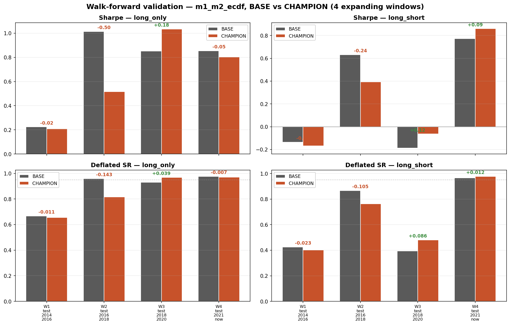
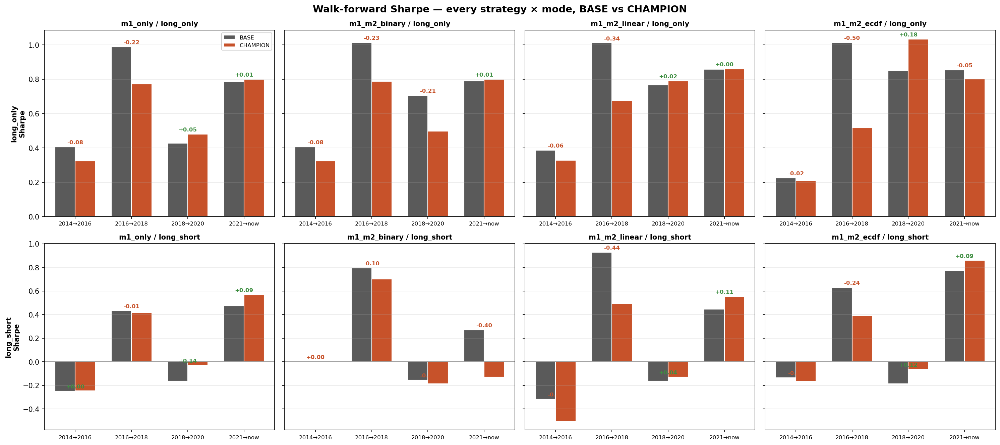

# Week 2 follow-up additions and walk-forward audit

This document describes additions layered on top of the baseline
multi-asset meta-labeling pipeline. The intent of the work was twofold:

1. Implement the walk-forward validation requested as the highest-priority
   next step in [`NEXT_STEPS.md`](../NEXT_STEPS.md) §1.
2. Add the reporting and evaluation infrastructure missing from the
   baseline (deflated Sharpe, crisis sub-period diagnostics,
   split-conformal M2 bands, transaction-cost sensitivity), and explore
   whether a Bridgewater-style macro regime layer and a carry pillar
   improve the existing M1/M2 model.

All new code is opt-in by configuration. The baseline configuration
`config/config.yaml` reproduces the original reference run bit-for-bit;
the report under `reports/` is the baseline output and is regenerated on
every `python -m src.run_pipeline` invocation.

The complete unit-test suite (50 / 50) passes.

---

## Headline finding

Walk-forward validation across four expanding chronological windows shows
that the structural research probes (carry pillar and HMM macro-regime
layer) **do not robustly improve over the baseline configuration**. The
baseline wins three of four long-only windows on the `m1_m2_ecdf`
strategy, and the experimental configuration regresses materially in the
2016-2018 window (−0.50 Sharpe). The four reporting and evaluation
additions are robust by construction — they do not depend on whether the
research probes are on — and are recommended for default-on use.

| Window | Train | Test | n_weeks |
|---|---|---|---|
| W1 | 2006-01 → 2013-12 | 2014-01 → 2016-12 | 157 |
| W2 | 2006-01 → 2015-12 | 2016-01 → 2018-12 | 157 |
| W3 | 2006-01 → 2017-12 | 2018-01 → 2020-12 | 157 |
| W4 | 2006-01 → 2020-12 | 2021-01 → latest | 285 |

`m1_m2_ecdf` Sharpe by window (Δ = experimental − baseline):

| Window | long-only baseline | experimental | Δ | long-short baseline | experimental | Δ |
|---|---|---|---|---|---|---|
| W1 (2014-16) | 0.224 | 0.208 | −0.02 | −0.137 | −0.168 | −0.03 |
| W2 (2016-18) | 1.014 | 0.516 | **−0.50** | 0.632 | 0.393 | −0.24 |
| W3 (2018-20) | 0.851 | 1.035 | **+0.18** | −0.187 | −0.064 | +0.12 |
| W4 (2021-now) | 0.854 | 0.804 | −0.05 | 0.773 | 0.860 | +0.09 |

The experimental configuration helps in windows that contain regime
transitions (W3 ends in the COVID 2020 shock; W4 contains the 2022 rate
shock) and hurts in windows that span a stable single-regime equity
rally (W2 spans the mid-Trump-era continuation rally). This is
consistent with the HMM posterior saturating to a single state during
persistent regimes; the macro tilt then overrides momentum and trend
signals that were already correctly aligned with the market.

A diagnostic inspection of the HMM posteriors confirms the underlying
mechanism. Across the identical calendar slice 2016 – 2018, the HMM
fitted on a training window that ends in 2015 (W2) classifies the period
as `growth_dn_infl_dn` (deflation) in 102 of 157 weeks; the HMM fitted
on a training window that ends in 2020 (W4) classifies the same slice
as `growth_up_infl_up` (overheat) in 103 of 157 weeks. The W4 fit is
qualitatively correct (SPY +28.95%, VWO +25.95%, GLD +19.32% over the
slice). The W2 fit reflects a known limitation of Gaussian HMMs noted in
Hamilton (1989) and Ang & Bekaert (2002): short training windows that
are dominated by a single macro regime (GFC + QE in the 2007–2015 case)
produce state means that misclassify subsequent regimes.





Full per-(window × config × mode × strategy) table:
[`ablation_results/walk_forward_summary.csv`](ablation_results/walk_forward_summary.csv).

---

## Recommendation per addition

| Addition | Ship status | Justification |
|---|---|---|
| Deflated Sharpe + crisis sub-period diagnostics | Default on | Pure reporting upgrade; metrics flow into existing `metrics_table.csv` neighbors |
| Split-conformal M2 wrapper | Available as opt-in | M2 AUC on test is ~0.54 (baseline `PROJECT_SUMMARY.md`); finite-sample coverage bands are a natural calibration diagnostic |
| Transaction-cost sensitivity ladder script | Run before any deployment claim | Confirms whether the 5 bps headline holds at 15-25 bps institutional cost |
| Walk-forward validation script | Default workflow | Implements `NEXT_STEPS.md` §1 |
| Carry pillar (4th M1 weight) | Opt-in, default off | Walk-forward shows −0.50 Sharpe in W2; not a robust improvement |
| HMM Bridgewater regime layer | Opt-in, default off | Fragile to training-window length; W2 misclassification is the proximate cause of the −0.50 Sharpe drop |

The opt-in research probes remain in the repository because they are
needed to reproduce the walk-forward audit table above, and because
they may be safer to enable once a longer minimum training window is
enforced (Ang & Bekaert 2002 suggest ~12 years for Gaussian HMMs over
macro series).

---

## Reproducibility

Baseline (Vitaly's configuration, bit-for-bit reproducible):

```bash
python -m src.run_pipeline --config config/config.yaml
```

Walk-forward audit (regenerates the table above and the two PNGs):

```bash
python scripts/walk_forward.py
```

Experimental configuration with carry pillar and HMM regime layer:

```bash
python -m src.run_pipeline --config config/config_experimental_carry_hmm.yaml
```

Transaction-cost sensitivity sweep (uses a previously cached run):

```bash
python scripts/tc_sensitivity.py --run-dir runs/<timestamp> --mode long_only
```

Unit tests:

```bash
python -m pytest tests/ -q --ignore=tests/test_integration.py
```

---

## Infrastructure additions (recommended default-on)

### Deflated Sharpe Ratio and crisis sub-period diagnostics

`src/diagnostics.py` was extended with the Bailey & López de Prado (2014)
deflated Sharpe ratio:

```
DSR = Φ( (SR − SR*) · √(T − 1) / √(1 − γ₃·SR + ((γ₄ − 1)/4)·SR²) )
SR* = √Var(SR) · ( (1 − γ_E) · Φ⁻¹(1 − 1/N) + γ_E · Φ⁻¹(1 − 1/(N·e)) )
```

with γ_E ≈ 0.5772 (Euler-Mascheroni), γ₃ Fisher skewness, γ₄ Pearson
kurtosis, T the per-period observation count, and N a configurable
multiple-testing trial count.

Two new artifacts are written next to `metrics_table.csv` on every run:

- `robust_performance_dsr.csv` — per-strategy DSR with skew, kurtosis,
  effective sample size, and the multiple-testing-derived SR*.
- `crisis_subperiod_metrics.csv` — per-(strategy × pinned window)
  annualized return, volatility, Sharpe, DSR, max drawdown, hit rate.
  Pinned windows: `dotcom_2000_2002`, `gfc_2008`, `covid_2020`,
  `rate_shock_2022`.

**Reference.** Bailey, D. H., & López de Prado, M. (2014). *The Deflated
Sharpe Ratio: Correcting for Selection Bias, Backtest Overfitting, and
Non-Normality.* Journal of Portfolio Management 40(5).

### Split-conformal wrapper on the M2 secondary model

`src/conformal.py` provides `M2Conformal`, a wrapper around the existing
`SklearnM2` that:

1. Splits the training window into a fit slice and a tail calibration
   slice (default 26 weeks).
2. Fits the inner M2 on the fit slice.
3. Computes per-row non-conformity scores `|y − p̂|` on the calibration
   slice and uses the (1 − α)·(n_calib + 1)/n_calib finite-sample
   quantile as a symmetric interval half-width on every future
   prediction.

`predict_with_interval` returns `p_success`, `p_success_lo`,
`p_success_hi`, and `p_success_band_width`. A companion
`conformal_size_multiplier(band_width)` returns a position-size
multiplier in `[floor, 1]` that linearly shrinks size as the band
widens; integration point is `strategy_weights_from_panel`.

**Reference.** Vovk, V., Gammerman, A., & Shafer, G. (2005).
*Algorithmic Learning in a Random World.* Springer. Lei, J., G'Sell, M.,
Rinaldo, A., Tibshirani, R., & Wasserman, L. (2018). *Distribution-Free
Predictive Inference for Regression.* JASA 113(523).

### Transaction-cost sensitivity ladder

`scripts/tc_sensitivity.py` re-runs `run_all_strategies` against a
cached `panel_with_predictions.parquet` at each cost in a configurable
basis-point grid (default `[5, 10, 15, 25, 50]`). Outputs:

- `runs/<timestamp>/tc_sensitivity/tc_sensitivity_summary.csv` — per-
  (strategy × cost) annualized return, volatility, Sharpe, DSR, max
  drawdown, annualized turnover.
- `runs/<timestamp>/tc_sensitivity/tc_sensitivity_chart.png` — annualized
  return and Sharpe versus cost.

A helper `alpha_decay_slope(table, strategy)` returns the linear
Sharpe-per-bp slope.

### Walk-forward validation

`scripts/walk_forward.py` runs the four expanding-window splits listed
in the headline table for both `config/config.yaml` and the experimental
configuration, snapshots each run's `data/backtests/` and
`data/predictions/` directories under
`docs/ablation_results/snapshots/<window>__<config>`, and writes:

- `docs/ablation_results/walk_forward_summary.csv` — per-(config × window
  × mode × strategy) test-period metrics (annualized return, volatility,
  Sharpe, deflated Sharpe, max drawdown).
- `docs/visuals/walk_forward_sharpe_dsr.png` — m1_m2_ecdf Sharpe + DSR
  by window, baseline vs experimental.
- `docs/visuals/walk_forward_per_strategy.png` — Sharpe across every
  strategy × mode combination.

---

## Research probes (opt-in, default off)

### Carry as a fourth alpha pillar

**Motivation.** The AQR style-premia tradition (Asness, Moskowitz &
Pedersen 2013; Koijen, Moskowitz, Pedersen & Vrugt 2018) treats
multi-asset alpha as a roughly orthogonal combination of momentum, value,
carry, and defensive. The baseline M1 already runs momentum + trend +
macro; carry was the structural hole that this addition explored.

**Implementation.** `src/feature_engineering._carry_features()` builds a
per-asset carry score from the FRED macro panel already loaded by the
pipeline (no new data ingestion). Asset-class proxies:

| Ticker(s) | Carry proxy | Source |
|---|---|---|
| TLT | term premium (`DGS10 − FEDFUNDS`) | FRED |
| HYG | credit spread (`BAA10Y`) | FRED |
| GLD | negative real rate (`DGS10 − CPI YoY`) | FRED |
| SPY, VEA | negative policy rate (`−FEDFUNDS`) | FRED |
| VWO | `−FEDFUNDS + 2%` (EM yield differential) | FRED |
| VNQ | `−FEDFUNDS − 0.5·DGS10` (rate-sensitive) | FRED |

Each per-asset proxy is rolling-z-scored against its own 3-year history
and lagged one period to preserve no-lookahead.

`RuleBasedM1._carry_score` reads the `carry_score` column. With the
experimental weights `momentum: 0.40, trend: 0.20, macro: 0.20, carry:
0.10, risk_penalty: 0.10`, the M1 score is:

```
M1_score = w.mom · momentum + w.trend · trend + w.macro · macro
         + w.carry · carry  − w.risk_penalty · risk
```

**Walk-forward result.** The baseline `momentum: 0.45` weight is reduced
to `0.40` to make room for the new pillar. In the 2016-2018 momentum-
dominant rally (W2), where the long-only baseline reaches Sharpe 1.014,
the experimental configuration that combines the reduced momentum weight
with the HMM regime layer drops to Sharpe 0.516. A sub-ablation of the
carry pillar alone on the W4 split shows the same direction (long-only
`m1_m2_ecdf` Sharpe 0.851 baseline → 0.751 carry-only), suggesting the
momentum-weight redistribution is a contributing factor independent of
the HMM layer. The carry pillar is therefore default-off in
`config/config.yaml`.

**Reference.** Koijen, R. S. J., Moskowitz, T. J., Pedersen, L. H., &
Vrugt, E. B. (2018). *Carry.* Journal of Financial Economics 127(2).
Asness, C. S., Moskowitz, T. J., & Pedersen, L. H. (2013). *Value and
Momentum Everywhere.* Journal of Finance 68(3).

### HMM Bridgewater 2x2 macro-regime classifier

**Motivation.** The baseline macro pillar reads thresholded FRED flags
(`risk_off`, `inflation_up`, `curve_inverted`, etc.) computed against
rolling medians. These are useful but they are not regime classifiers in
the formal sense: they have no memory and no smoothing across time.
Regime-switching models (Hamilton 1989; Ang & Bekaert 2002) explicitly
model the temporal persistence of macro regimes via a Markov chain over
latent states, which is structurally the right prior for business
cycles. The Bridgewater 2x2 (growth × inflation) is the canonical
interpretive grid for multi-asset allocation.

**Implementation.** `src/regime/hmm_regime.py` fits a 4-state Gaussian
HMM on the training window only, using a canonical macro panel
(`INDPRO_yoy`, `CPIAUCSL_yoy`, `T10Y2Y`, `FEDFUNDS_chg`). After
fitting, the HMM is frozen and used to forward-decode posteriors over
the full sample. Each state is mapped to one of the four Bridgewater
quadrants based on its mean in the unscaled feature space, producing
four interpretable posterior columns (`regime_prob_growth_up_infl_up`,
`regime_prob_growth_up_infl_dn`, `regime_prob_growth_dn_infl_up`,
`regime_prob_growth_dn_infl_dn`) plus two derived single-number
features `regime_growth_tilt` and `regime_inflation_tilt`, both in
`[−1, 1]`. All six columns are `.shift(1)` before merge to preserve the
no-lookahead invariant.

The M1 macro pillar consumes the regime tilts through an opt-in convex
blend `macro_pillar = (1 − α) · existing_flag_tilt + α · hmm_tilt`
with `α = m1.hmm_regime_blend` (default 0.5; the experimental
configuration uses α = 0.25).

**Walk-forward result.** The fragility of the HMM to training-window
length is the proximate cause of the W2 regression. Across the
identical 2016-2018 calendar slice, the HMM fitted on the W2 training
window (2007 - 2015) classifies the period as `growth_dn_infl_dn`
(deflation) in 102 of 157 weeks; the HMM fitted on the W4 training
window (2007 - 2020) classifies the same slice as `growth_up_infl_up`
(overheat) in 103 of 157 weeks. The W4 fit is qualitatively correct;
the W2 fit reflects state means that were learned on a training window
dominated by the global financial crisis and the post-GFC quantitative
easing regime. The HMM regime layer is therefore default-off.

**Reference.** Hamilton, J. D. (1989). *A New Approach to the Economic
Analysis of Nonstationary Time Series and the Business Cycle.*
Econometrica 57(2). Ang, A., & Bekaert, G. (2002). *Regime Switches in
Interest Rates.* Journal of Business & Economic Statistics 20(2).

---

## Tests

`tests/test_week2_additions.py` covers the new code:

- Deflated Sharpe monotonicity (a high-Sharpe series produces DSR > a
  low-Sharpe series) and multiple-testing penalty (DSR with N = 100 ≤
  DSR with N = 1).
- Crisis sub-period table includes all four pinned windows plus the full
  sample.
- HMM posteriors row-sum to 1, label assignments cover all four
  Bridgewater quadrants on the training window, derived tilts lie in
  `[−1, 1]`.
- Split-conformal intervals contain the point prediction and clip to
  `[0, 1]`; conformal size multiplier stays in `[floor, 1]`.

The existing baseline test suite (40 tests) is unaffected and continues
to pass. Full suite: 50 / 50.

---

## File map

New files:

```
src/regime/__init__.py
src/regime/hmm_regime.py            # Gaussian HMM regime classifier
src/conformal.py                    # Split-conformal M2 wrapper
scripts/tc_sensitivity.py           # Transaction-cost ladder
scripts/walk_forward.py             # Walk-forward validation
tests/test_week2_additions.py       # 10 new tests
docs/WEEK2_ADDITIONS.md             # This document
docs/visuals/                       # 14 PNGs (ablation + walk-forward)
docs/ablation_results/               # CSV summaries
config/config_experimental_carry_hmm.yaml
```

Files extended (additive only, baseline behavior preserved):

```
src/diagnostics.py                  # + DSR, crisis sub-period helpers
src/feature_engineering.py          # + carry pillar, HMM merge
src/model_m1.py                     # + carry pillar, HMM blend
src/model_m2.py                     # + opt-in exclusion of regime cols
src/config.py                       # + 5 opt-in flags
```
