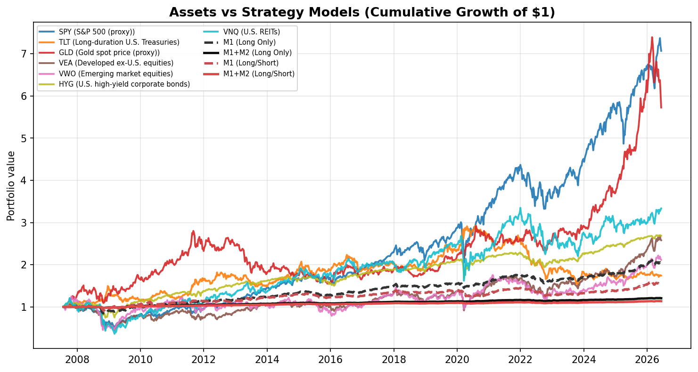
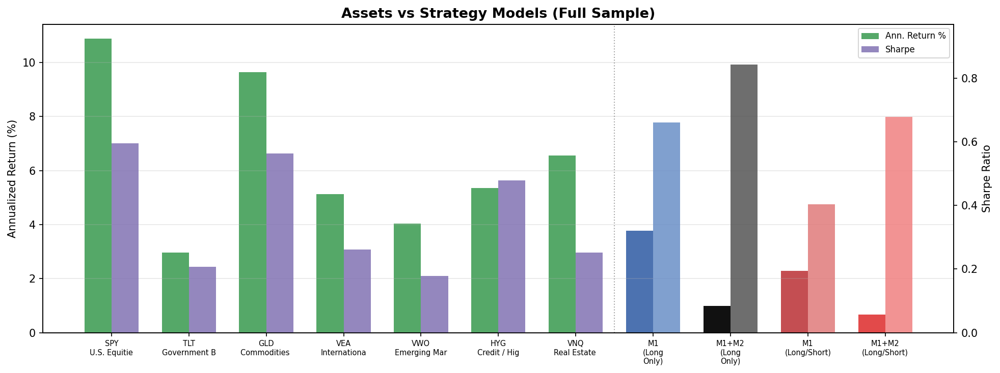
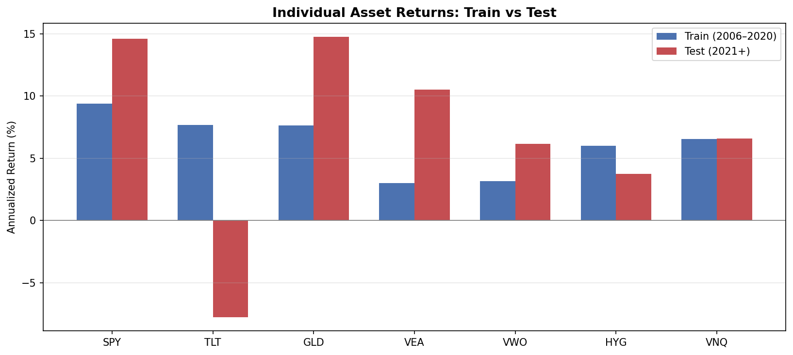

# Asset & Component Analysis

Standalone buy-and-hold performance for each ETF in the universe, plus documentation of all data inputs.

**Research use only — not investment advice.**

## Data & Components Used

The pipeline combines **seven tradable ETF proxies** for major asset classes plus **macro/risk indicators** for regime features. Prices are resampled to **weekly** (Friday close) from daily adjusted-close data.

| Field | Value |
| --- | --- |
| Sample start | 2007-07-27 |
| Sample end | 2026-06-12 |
| Frequency | Weekly (W-FRI) |
| Price field | Adjusted close |

### Tradable ETF Components

| Ticker | Instrument | Proxy / Benchmark | Asset Class | Role in Portfolio | Data Source |
| --- | --- | --- | --- | --- | --- |
| SPY | SPDR S&P 500 ETF Trust | S&P 500 (proxy) | U.S. Equities | U.S. large-cap equity beta and growth exposure | yfinance — adjusted close, weekly |
| TLT | iShares 20+ Year Treasury Bond ETF | Long-duration U.S. Treasuries | Government Bonds | Duration and defensive interest-rate exposure | yfinance — adjusted close, weekly |
| GLD | SPDR Gold Shares | Gold spot price (proxy) | Commodities / Gold | Inflation hedge and safe-haven commodity exposure | yfinance — adjusted close, weekly |
| VEA | Vanguard FTSE Developed Markets ETF | Developed ex-U.S. equities | International Equities | Geographic diversification outside the U.S. | yfinance — adjusted close, weekly |
| VWO | Vanguard FTSE Emerging Markets ETF | Emerging market equities | Emerging Market Equities | Emerging market growth and risk premia | yfinance — adjusted close, weekly |
| HYG | iShares iBoxx High Yield Corporate Bond ETF | U.S. high-yield corporate bonds | Credit / High Yield | Credit risk and income exposure | yfinance — adjusted close, weekly |
| VNQ | Vanguard Real Estate ETF | U.S. REITs | Real Estate (REITs) | Real estate and rate-sensitive income exposure | yfinance — adjusted close, weekly |

### Macro & Risk Indicators (features only)

These series are **not traded** in the backtest. They feed M1/M2 regime and false-positive features, lagged by 4 weeks to approximate publication delay.

| Series | Description | Use | Source |
| --- | --- | --- | --- |
| CPIAUCSL | Consumer Price Index | Inflation trend and regime indicator | FRED — lagged 4 weeks in features |
| UNRATE | Unemployment Rate | Labor market / growth proxy | FRED — lagged 4 weeks in features |
| INDPRO | Industrial Production Index | Economic growth proxy | FRED — lagged 4 weeks in features |
| FEDFUNDS | Federal Funds Rate | Monetary policy stance | FRED — lagged 4 weeks in features |
| DGS10 | 10-Year Treasury Yield | Long-term interest rate level | FRED — lagged 4 weeks in features |
| T10Y2Y | 10Y–2Y Treasury Spread | Yield curve slope / recession signal | FRED — lagged 4 weeks in features |
| BAA10Y | Baa–10Y Credit Spread | Credit stress indicator | FRED — lagged 4 weeks in features |
| VIX | CBOE Volatility Index | Equity risk sentiment (risk-on / risk-off) | yfinance (^VIX) — used in features, not traded |

## Individual Asset Performance (Buy-and-Hold)

Each row below is a **standalone buy-and-hold** of one ETF: 100% allocated to that asset, rebalanced weekly, **no transaction costs**, no M1/M2 overlay. This shows how each building block performed on its own before any strategy logic. Charts also overlay **M1** and **M1+M2** portfolio models (long-only and long/short) for comparison.

### Full Sample

| Ticker | Asset | Class | Ann. Return | Ann. Volatility | Sharpe | Max Drawdown | Total Return | Weekly Hit Rate |
| --- | --- | --- | --- | --- | --- | --- | --- | --- |
| SPY | SPDR S&P 500 ETF Trust | U.S. Equities | 10.8782% | 18.2811% | 0.5951 | -54.6130% | 607.1129% | 57.3604% |
| TLT | iShares 20+ Year Treasury Bond ETF | Government Bonds | 2.9717% | 14.3522% | 0.2071 | -47.8267% | 74.1417% | 53.5025% |
| GLD | SPDR Gold Shares | Commodities / Gold | 9.6506% | 17.1340% | 0.5632 | -44.7446% | 472.6647% | 54.9239% |
| VEA | Vanguard FTSE Developed Markets ETF | International Equities | 5.1290% | 19.6234% | 0.2614 | -59.0021% | 157.9133% | 55.5330% |
| VWO | Vanguard FTSE Emerging Markets ETF | Emerging Market Equities | 4.0303% | 22.5913% | 0.1784 | -63.8086% | 111.3700% | 52.7919% |
| HYG | iShares iBoxx High Yield Corporate Bond ETF | Credit / High Yield | 5.3554% | 11.2039% | 0.4780 | -33.0009% | 168.6410% | 58.4772% |
| VNQ | Vanguard Real Estate ETF | Real Estate (REITs) | 6.5646% | 26.0759% | 0.2518 | -70.2120% | 233.4693% | 55.3299% |

### Train Period (2006-01-01 to 2020-12-31)

| Ticker | Asset | Class | Ann. Return | Ann. Volatility | Sharpe | Max Drawdown | Total Return | Weekly Hit Rate |
| --- | --- | --- | --- | --- | --- | --- | --- | --- |
| SPY | SPDR S&P 500 ETF Trust | U.S. Equities | 9.3926% | 19.1490% | 0.4905 | -54.6130% | 234.8409% | 57.8571% |
| TLT | iShares 20+ Year Treasury Bond ETF | Government Bonds | 7.6818% | 14.2777% | 0.5380 | -25.1822% | 170.8210% | 56.0000% |
| GLD | SPDR Gold Shares | Commodities / Gold | 7.6458% | 17.4949% | 0.4370 | -44.7446% | 169.6071% | 54.2857% |
| VEA | Vanguard FTSE Developed Markets ETF | International Equities | 3.0057% | 20.8513% | 0.1442 | -59.0021% | 48.9824% | 55.1429% |
| VWO | Vanguard FTSE Emerging Markets ETF | Emerging Market Equities | 3.1832% | 24.6520% | 0.1291 | -63.8086% | 52.4754% | 52.0000% |
| HYG | iShares iBoxx High Yield Corporate Bond ETF | Credit / High Yield | 6.0127% | 12.5519% | 0.4790 | -33.0009% | 119.4601% | 60.2857% |
| VNQ | Vanguard Real Estate ETF | Real Estate (REITs) | 6.5635% | 28.6584% | 0.2290 | -70.2120% | 135.3171% | 56.7143% |

### Test Period (2021-01-01 to latest)

| Ticker | Asset | Class | Ann. Return | Ann. Volatility | Sharpe | Max Drawdown | Total Return | Weekly Hit Rate |
| --- | --- | --- | --- | --- | --- | --- | --- | --- |
| SPY | SPDR S&P 500 ETF Trust | U.S. Equities | 14.6131% | 15.9747% | 0.9148 | -23.9272% | 111.1788% | 56.1404% |
| TLT | iShares 20+ Year Treasury Bond ETF | Government Bonds | -7.7410% | 14.4461% | -0.5359 | -43.7988% | -35.6986% | 47.3684% |
| GLD | SPDR Gold Shares | Commodities / Gold | 14.7345% | 16.2274% | 0.9080 | -22.5674% | 112.4071% | 56.4912% |
| VEA | Vanguard FTSE Developed Markets ETF | International Equities | 10.5316% | 16.2355% | 0.6487 | -29.4775% | 73.1166% | 56.4912% |
| VWO | Vanguard FTSE Emerging Markets ETF | Emerging Market Equities | 6.1403% | 16.5087% | 0.3719 | -33.4800% | 38.6257% | 54.7368% |
| HYG | iShares iBoxx High Yield Corporate Bond ETF | Credit / High Yield | 3.7583% | 6.8592% | 0.5479 | -15.3951% | 22.4099% | 54.0351% |
| VNQ | Vanguard Real Estate ETF | Real Estate (REITs) | 6.5674% | 18.2858% | 0.3592 | -34.2941% | 41.7106% | 51.9298% |

### Per-Asset Highlights

- **SPY** (S&P 500 (proxy)): 10.8782% annualized, Sharpe 0.5951, max drawdown -54.6130% — U.S. large-cap equity beta and growth exposure.
- **GLD** (Gold spot price (proxy)): 9.6506% annualized, Sharpe 0.5632, max drawdown -44.7446% — Inflation hedge and safe-haven commodity exposure.
- **VNQ** (U.S. REITs): 6.5646% annualized, Sharpe 0.2518, max drawdown -70.2120% — Real estate and rate-sensitive income exposure.
- **HYG** (U.S. high-yield corporate bonds): 5.3554% annualized, Sharpe 0.4780, max drawdown -33.0009% — Credit risk and income exposure.
- **VEA** (Developed ex-U.S. equities): 5.1290% annualized, Sharpe 0.2614, max drawdown -59.0021% — Geographic diversification outside the U.S..
- **VWO** (Emerging market equities): 4.0303% annualized, Sharpe 0.1784, max drawdown -63.8086% — Emerging market growth and risk premia.
- **TLT** (Long-duration U.S. Treasuries): 2.9717% annualized, Sharpe 0.2071, max drawdown -47.8267% — Duration and defensive interest-rate exposure.

## Notes

- **SPY** is used as the practical proxy for the **S&P 500** in this ETF-only universe.
- **TLT** and **HYG** represent the **bond** sleeve (duration government vs. high-yield credit).
- **VEA** and **VWO** split developed vs. emerging international equities.
- **GLD** provides commodity/gold exposure; **VNQ** provides listed real estate.
- Strategy results in the main report combine these components via M1 signals and M2 sizing.
