# Final Report: AI-Augmented Multi-Asset Meta-Labeling Pipeline

This run executes the pipeline **twice**: once with M1 **long-only** (no short signals) and once with M1 **long/short** enabled.

**Research use only — not investment advice.**

## Sample Period

| Item | Value |
| --- | --- |
| Effective start | 2007-07-27 |
| Effective end | 2026-06-12 |
| Data download from | 2000-01-01 |
| Train period (requested) | 2006-01-01 to 2020-12-31 |
| Test period (M2 evaluation) | 2021-01-01 to latest |
| Universe mode | all 7 ETFs each week |
| Assets | SPY, TLT, GLD, VEA, VWO, HYG, VNQ |

## Configuration Parameters Affecting Performance

The pipeline reads defaults from `config/config.yaml`. **Split dates** can also be set at runtime without editing the file (see CLI below). Other parameters require config edits.

### Train / Test Split

| Parameter | Current value | Performance impact |
| --- | --- | --- |
| `split.data_start` | 2000-01-01 | Earliest downloaded price date (can precede train for feature warmup) |
| `split.train_start` | 2006-01-01 | Intended train window start (clipped to effective panel start) |
| `split.train_end` | 2020-12-31 | Last in-sample date; **primary knob for tuning in-sample fit** |
| `split.test_start` | 2021-01-01 | Out-of-sample evaluation begins here (M2 metrics, IC, and test-period strategy tables) |
| `split.test_end` | latest (open-ended) | Optional cap on the evaluation window |
| `split.require_full_universe` | True | If true, only weeks with all 7 ETFs (~2007+); if false, partial groups allowed |

**Can train_start be before 2006?** Yes in config/CLI, but with `require_full_universe: true` (default) the **effective** sample usually starts ~**2007-07** when VEA and HYG (youngest ETFs) both exist. Dates before that are dropped. Set `require_full_universe: false` or `--partial-universe` to train on subsets (e.g. SPY/TLT/GLD/VNQ/VWO from 2005).

**CLI overrides** (ISO dates, applied after loading config):

```bash
# Shorter/longer train, earlier/later test — compare Sharpe in reports/final_report.md
python -m src.run_pipeline --train-end 2018-12-31 --test-start 2019-01-01
python -m src.run_pipeline --train-end 2015-12-31 --test-start 2016-01-01
python -m src.run_pipeline --train-start 2008-01-01 --train-end 2012-12-31 --test-start 2013-01-01

# Earlier history: partial universe before all seven ETFs existed
python -m src.run_pipeline --data-start 2004-01-01 --train-start 2005-01-01 --train-end 2006-12-31 --test-start 2007-01-01 --partial-universe --refresh-data
```

Shorter train windows reduce overfitting risk but give fewer M2 labels; varying `train_end` is the fastest way to test whether performance is stable across in-sample cutoffs.

### M1 Rule-Based Side Model

| Parameter | Current value | Performance impact |
| --- | --- | --- |
| `models.m1.weights` | momentum=0.45, trend=0.25, macro=0.2, risk=0.1 | Relative importance of factor families in the composite score |
| `models.m1.optimize_thresholds` | True | When true, long/short cutoffs are tuned on the train set only |
| `models.m1.long_quantile` / `short_quantile` | 0.58 / 0.22 | Starting quantiles for threshold search (higher long quantile → fewer longs) |
| `models.m1.allow_short` | False | Default shorting flag; pipeline always runs both long-only and long/short modes |
| `models.m1.asset_class_tilts` | True | Macro tilts by asset class (equity, bonds, credit, gold, REIT) |
| `models.m1.allocation_mode` | top_k | `threshold` (absolute cutoffs) or `top_k` (weekly cross-sectional rank) |
| `models.m1.top_k` | 3 | Number of names to long each week when `allocation_mode=top_k` |
| `models.m1.conviction_sizing` | False | Scale weights by normalized M1 score before M2 sizing |
| `models.m1.tune_objective` | portfolio | `trade` or `portfolio` Sharpe for threshold tuning (threshold mode only) |

### M2 Meta-Labeling

| Parameter | Current value | Performance impact |
| --- | --- | --- |
| `models.m2.threshold` | 0.55 | Minimum P(success) to take full size; higher → fewer trades, often lower turnover |
| `models.m2.calibrate` | True | Probability calibration on train data; improves threshold interpretability |
| `models.m2.type` | logistic_regression | Classifier used for meta-labels |

### Labels (M1 targets & M2 supervision)

| Parameter | Current value | Performance impact |
| --- | --- | --- |
| `labels.horizon_weeks` | 4 | Forward return horizon for profitability labels |
| `labels.positive_threshold` | 0.005 | Minimum forward return to label a long as successful |
| `labels.negative_threshold` | -0.005 | Forward return threshold for short success |
| `labels.transaction_cost_threshold` | 0.001 | Cost hurdle embedded in label construction |

### Portfolio & Costs

| Parameter | Current value | Performance impact |
| --- | --- | --- |
| `portfolio.transaction_cost_bps` | 5 | Round-trip cost per unit turnover; higher values drag net returns |
| `portfolio.max_gross_exposure` | 1.0 | Cap on sum of absolute weights |
| `portfolio.max_abs_asset_weight` | 0.25 | Per-asset weight ceiling |
| `portfolio.sizing_mode` | linear | How M2 probability maps to position size (binary / linear / ecdf) |
| `portfolio.vol_target_ann` | 0.12 | Annualized vol target for gross scaling (null disables) |
| `portfolio.vol_target_lookback_weeks` | 26 | Trailing window for realized vol estimate |

### Features

| Parameter | Current value | Performance impact |
| --- | --- | --- |
| `features.momentum_windows` | [4, 12, 26, 52] | Lookback weeks for momentum factors |
| `features.macro_lag_weeks` | 4 | Release lag applied to macro series (reduces look-ahead) |
| `features.winsorize_pct` | 0.01 | Train-set winsorization of extreme feature values |

## Data & Components Used

The pipeline combines **seven tradable ETF proxies** for major asset classes plus **macro/risk indicators** for regime features. Prices are resampled to **weekly** (Friday close) from daily adjusted-close data.

| Field | Value |
| --- | --- |
| Sample start | 2007-07-27 |
| Sample end | 2026-06-12 |
| Frequency | Weekly (W-FRI) |
| Price field | Adjusted close |

### Tradable ETF Components

| Ticker | Instrument | Proxy / Benchmark | Asset Class | Role in Portfolio | Data Source |
| --- | --- | --- | --- | --- | --- |
| SPY | SPDR S&P 500 ETF Trust | S&P 500 (proxy) | U.S. Equities | U.S. large-cap equity beta and growth exposure | yfinance — adjusted close, weekly |
| TLT | iShares 20+ Year Treasury Bond ETF | Long-duration U.S. Treasuries | Government Bonds | Duration and defensive interest-rate exposure | yfinance — adjusted close, weekly |
| GLD | SPDR Gold Shares | Gold spot price (proxy) | Commodities / Gold | Inflation hedge and safe-haven commodity exposure | yfinance — adjusted close, weekly |
| VEA | Vanguard FTSE Developed Markets ETF | Developed ex-U.S. equities | International Equities | Geographic diversification outside the U.S. | yfinance — adjusted close, weekly |
| VWO | Vanguard FTSE Emerging Markets ETF | Emerging market equities | Emerging Market Equities | Emerging market growth and risk premia | yfinance — adjusted close, weekly |
| HYG | iShares iBoxx High Yield Corporate Bond ETF | U.S. high-yield corporate bonds | Credit / High Yield | Credit risk and income exposure | yfinance — adjusted close, weekly |
| VNQ | Vanguard Real Estate ETF | U.S. REITs | Real Estate (REITs) | Real estate and rate-sensitive income exposure | yfinance — adjusted close, weekly |

### Macro & Risk Indicators (features only)

These series are **not traded** in the backtest. They feed M1/M2 regime and false-positive features, lagged by 4 weeks to approximate publication delay.

| Series | Description | Use | Source |
| --- | --- | --- | --- |
| CPIAUCSL | Consumer Price Index | Inflation trend and regime indicator | FRED — lagged 4 weeks in features |
| UNRATE | Unemployment Rate | Labor market / growth proxy | FRED — lagged 4 weeks in features |
| INDPRO | Industrial Production Index | Economic growth proxy | FRED — lagged 4 weeks in features |
| FEDFUNDS | Federal Funds Rate | Monetary policy stance | FRED — lagged 4 weeks in features |
| DGS10 | 10-Year Treasury Yield | Long-term interest rate level | FRED — lagged 4 weeks in features |
| T10Y2Y | 10Y–2Y Treasury Spread | Yield curve slope / recession signal | FRED — lagged 4 weeks in features |
| BAA10Y | Baa–10Y Credit Spread | Credit stress indicator | FRED — lagged 4 weeks in features |
| VIX | CBOE Volatility Index | Equity risk sentiment (risk-on / risk-off) | yfinance (^VIX) — used in features, not traded |

## Individual Asset Performance (Buy-and-Hold)

Each row below is a **standalone buy-and-hold** of one ETF: 100% allocated to that asset, rebalanced weekly, **no transaction costs**, no M1/M2 overlay. This shows how each building block performed on its own before any strategy logic. Charts also overlay **M1** and **M1+M2** portfolio models (long-only and long/short) for comparison.

### Full Sample

| Ticker | Asset | Class | Ann. Return | Ann. Volatility | Sharpe | Max Drawdown | Total Return | Weekly Hit Rate |
| --- | --- | --- | --- | --- | --- | --- | --- | --- |
| SPY | SPDR S&P 500 ETF Trust | U.S. Equities | 10.8782% | 18.2811% | 0.5951 | -54.6130% | 607.1128% | 57.3604% |
| TLT | iShares 20+ Year Treasury Bond ETF | Government Bonds | 2.9717% | 14.3522% | 0.2071 | -47.8268% | 74.1420% | 53.5025% |
| GLD | SPDR Gold Shares | Commodities / Gold | 9.6506% | 17.1340% | 0.5632 | -44.7446% | 472.6647% | 54.9239% |
| VEA | Vanguard FTSE Developed Markets ETF | International Equities | 5.1290% | 19.6234% | 0.2614 | -59.0021% | 157.9133% | 55.5330% |
| VWO | Vanguard FTSE Emerging Markets ETF | Emerging Market Equities | 4.0303% | 22.5913% | 0.1784 | -63.8086% | 111.3701% | 52.7919% |
| HYG | iShares iBoxx High Yield Corporate Bond ETF | Credit / High Yield | 5.3554% | 11.2039% | 0.4780 | -33.0008% | 168.6409% | 58.4772% |
| VNQ | Vanguard Real Estate ETF | Real Estate (REITs) | 6.5646% | 26.0759% | 0.2518 | -70.2120% | 233.4692% | 55.3299% |


### Train Period (2006-01-01 to 2020-12-31)

| Ticker | Asset | Class | Ann. Return | Ann. Volatility | Sharpe | Max Drawdown | Total Return | Weekly Hit Rate |
| --- | --- | --- | --- | --- | --- | --- | --- | --- |
| SPY | SPDR S&P 500 ETF Trust | U.S. Equities | 9.3926% | 19.1490% | 0.4905 | -54.6130% | 234.8409% | 57.8571% |
| TLT | iShares 20+ Year Treasury Bond ETF | Government Bonds | 7.6818% | 14.2777% | 0.5380 | -25.1822% | 170.8214% | 56.0000% |
| GLD | SPDR Gold Shares | Commodities / Gold | 7.6458% | 17.4949% | 0.4370 | -44.7446% | 169.6071% | 54.2857% |
| VEA | Vanguard FTSE Developed Markets ETF | International Equities | 3.0057% | 20.8513% | 0.1442 | -59.0021% | 48.9824% | 55.1429% |
| VWO | Vanguard FTSE Emerging Markets ETF | Emerging Market Equities | 3.1832% | 24.6519% | 0.1291 | -63.8086% | 52.4755% | 52.0000% |
| HYG | iShares iBoxx High Yield Corporate Bond ETF | Credit / High Yield | 6.0127% | 12.5519% | 0.4790 | -33.0008% | 119.4600% | 60.2857% |
| VNQ | Vanguard Real Estate ETF | Real Estate (REITs) | 6.5635% | 28.6584% | 0.2290 | -70.2120% | 135.3171% | 56.7143% |

### Test Period (2021-01-01 to latest)

| Ticker | Asset | Class | Ann. Return | Ann. Volatility | Sharpe | Max Drawdown | Total Return | Weekly Hit Rate |
| --- | --- | --- | --- | --- | --- | --- | --- | --- |
| SPY | SPDR S&P 500 ETF Trust | U.S. Equities | 14.6131% | 15.9747% | 0.9148 | -23.9272% | 111.1788% | 56.1404% |
| TLT | iShares 20+ Year Treasury Bond ETF | Government Bonds | -7.7410% | 14.4461% | -0.5359 | -43.7988% | -35.6986% | 47.3684% |
| GLD | SPDR Gold Shares | Commodities / Gold | 14.7345% | 16.2274% | 0.9080 | -22.5674% | 112.4071% | 56.4912% |
| VEA | Vanguard FTSE Developed Markets ETF | International Equities | 10.5316% | 16.2355% | 0.6487 | -29.4774% | 73.1167% | 56.4912% |
| VWO | Vanguard FTSE Emerging Markets ETF | Emerging Market Equities | 6.1403% | 16.5087% | 0.3719 | -33.4800% | 38.6256% | 54.7368% |
| HYG | iShares iBoxx High Yield Corporate Bond ETF | Credit / High Yield | 3.7583% | 6.8592% | 0.5479 | -15.3952% | 22.4099% | 54.0351% |
| VNQ | Vanguard Real Estate ETF | Real Estate (REITs) | 6.5674% | 18.2858% | 0.3592 | -34.2941% | 41.7106% | 51.9298% |


### Per-Asset Highlights

- **SPY** (S&P 500 (proxy)): 10.8782% annualized, Sharpe 0.5951, max drawdown -54.6130% — U.S. large-cap equity beta and growth exposure.
- **GLD** (Gold spot price (proxy)): 9.6506% annualized, Sharpe 0.5632, max drawdown -44.7446% — Inflation hedge and safe-haven commodity exposure.
- **VNQ** (U.S. REITs): 6.5646% annualized, Sharpe 0.2518, max drawdown -70.2120% — Real estate and rate-sensitive income exposure.
- **HYG** (U.S. high-yield corporate bonds): 5.3554% annualized, Sharpe 0.4780, max drawdown -33.0008% — Credit risk and income exposure.
- **VEA** (Developed ex-U.S. equities): 5.1290% annualized, Sharpe 0.2614, max drawdown -59.0021% — Geographic diversification outside the U.S..
- **VWO** (Emerging market equities): 4.0303% annualized, Sharpe 0.1784, max drawdown -63.8086% — Emerging market growth and risk premia.
- **TLT** (Long-duration U.S. Treasuries): 2.9717% annualized, Sharpe 0.2071, max drawdown -47.8268% — Duration and defensive interest-rate exposure.

See also: [assets/asset_component_analysis.md](assets/asset_component_analysis.md) for the full standalone write-up.

## M2 Performance by M1 Signal

M1 outputs three signal types per asset-week: **short (−1)**, **flat (0)**, or **long (+1)**. M2 only trains and predicts on non-zero signals. Below we break out **test-set** trade outcomes and classifier quality within each M1 group.

- **M1 hit rate**: share of trades with positive forward return (after cost hurdle)
- **M2 approval rate**: share of trades where `p_success` ≥ threshold
- **Hit rate (M2 approved)**: profitability among trades M2 kept

### Long-Only vs Long/Short Comparison

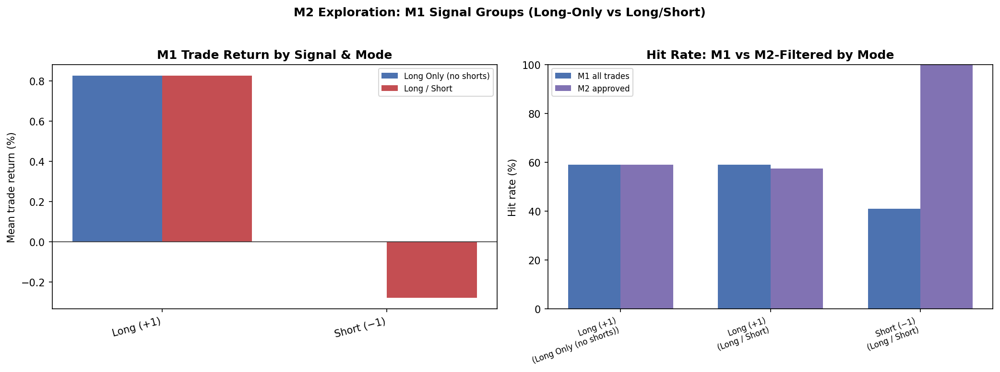

*Left: mean forward trade return by M1 signal. Right: M1 vs M2-filtered hit rates (long-only has no short bucket).*

### Long Only (no shorts)

`allow_short=False` — M2 threshold = 0.55

| M1 Signal | Observations | Share | Labeled Trades | M1 Hit Rate | Mean Trade Return | M2 Approval Rate | Hit Rate (M2 Approved) | M2 Precision | M2 Recall | M2 F1 |
| --- | --- | --- | --- | --- | --- | --- | --- | --- | --- | --- |
| Flat (0) | 1140 | 57.1429% | 0 | — | — | — | — | — | — | — |
| Long (+1) | 855 | 42.8571% | 855 | 58.9474% | 0.8266% | 100.0000% | 58.9474% | 0.5895 | 1.0000 | 0.7417 |

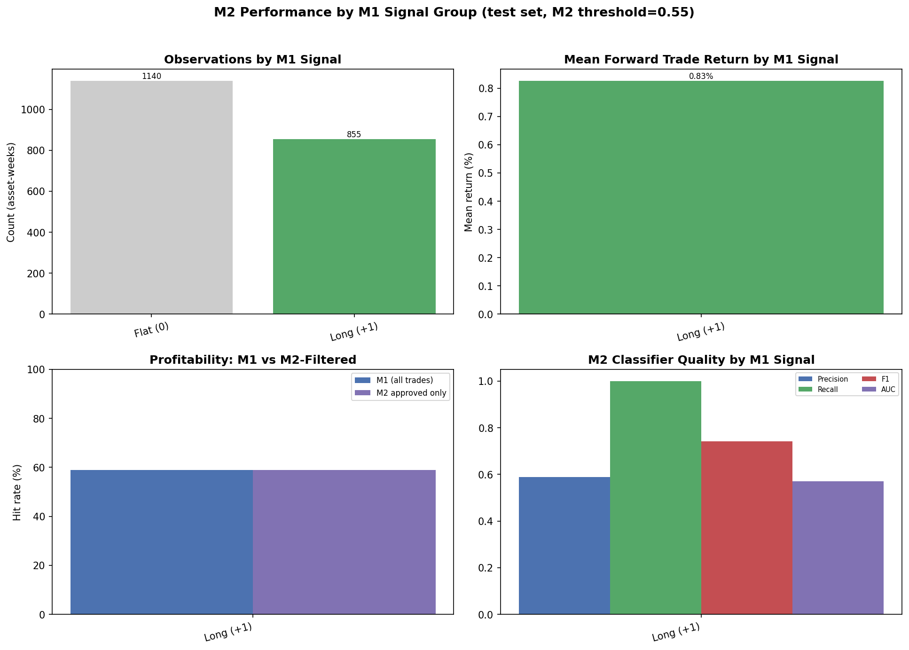
*Long-only mode: M1 never emits −1; shorts are disabled at the signal layer.*

### Long / Short

`allow_short=True` — M2 threshold = 0.55

| M1 Signal | Observations | Share | Labeled Trades | M1 Hit Rate | Mean Trade Return | M2 Approval Rate | Hit Rate (M2 Approved) | M2 Precision | M2 Recall | M2 F1 |
| --- | --- | --- | --- | --- | --- | --- | --- | --- | --- | --- |
| Short (−1) | 855 | 42.8571% | 855 | 40.9357% | -0.2784% | 0.2339% | 100.0000% | 1.0000 | 0.0057 | 0.0114 |
| Flat (0) | 285 | 14.2857% | 0 | — | — | — | — | — | — | — |
| Long (+1) | 855 | 42.8571% | 855 | 58.9474% | 0.8266% | 65.4971% | 57.5000% | 0.5750 | 0.6389 | 0.6053 |

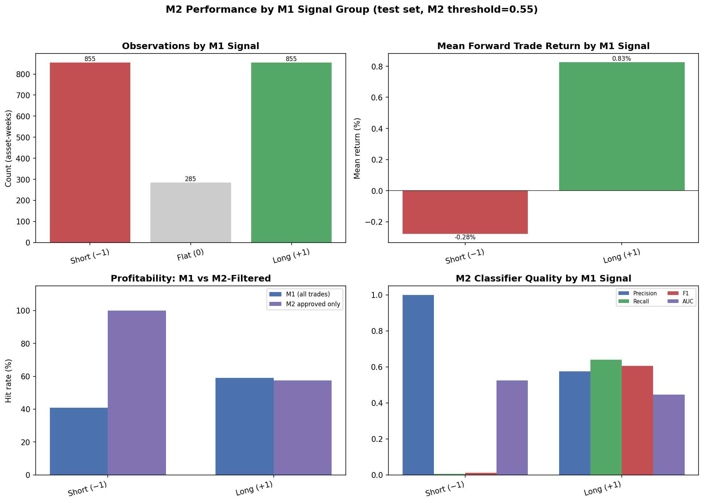
## M1 Mode Comparison (M1 Only)

| Mode | Ann. Return | Sharpe | Max Drawdown |
| --- | --- | --- | --- |
| Long Only (no shorts) | 7.3198% | 0.7021 | -21.0040% |
| Long / Short | 1.4041% | 0.2031 | -14.8093% |

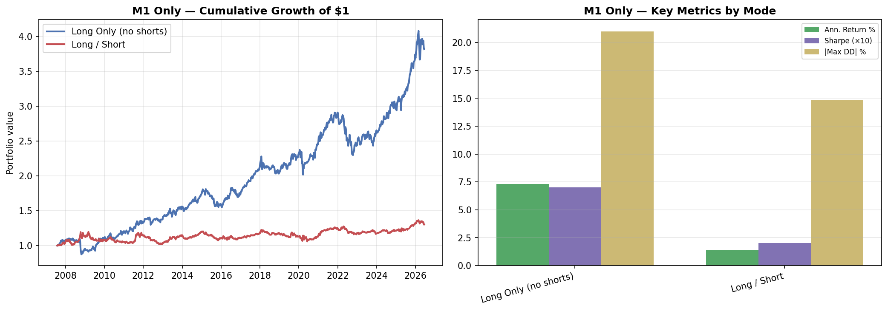

*Left: cumulative M1-only returns. Right: return, Sharpe (×10), and drawdown by mode.*

## M1 Exposure & Signal Quality Diagnostics

Understanding **how much capital M1 deploys** versus benchmark buy-and-hold helps separate low return from low edge.

### Portfolio Exposure (M1 only)

| Metric | Value |
| --- | --- |
| Mean gross exposure | 80.6105% |
| Median gross exposure | 85.7142% |
| Mean implied cash (1 − gross) | 19.3895% |
| Mean active names per week | 3.00 |
| Weeks below 50% invested | 5.0710% |
| Mean gross vs equal-weight | -19.2881% |

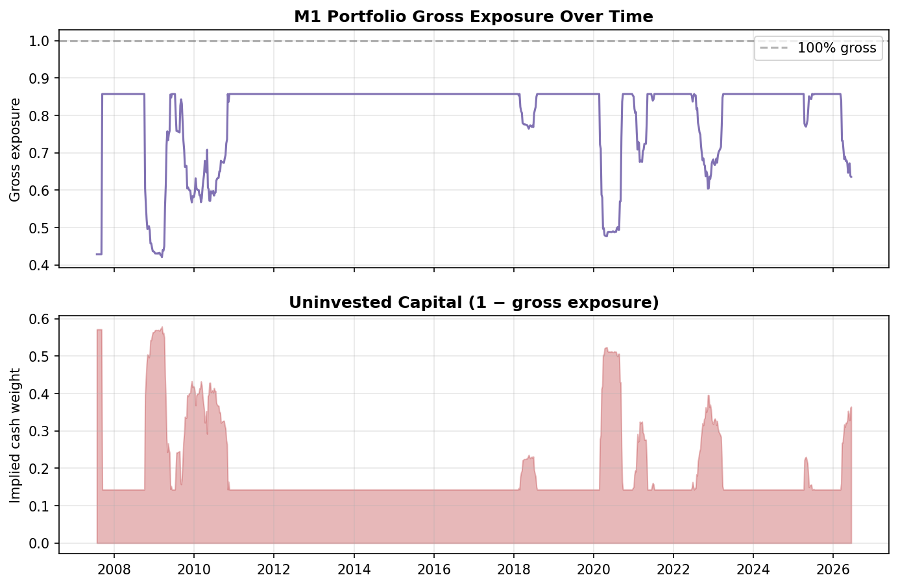

### Per-Asset IC (M1 score vs forward return)

| Ticker | IC | Observations | Hit rate (active) |
| --- | --- | --- | --- |
| VEA | 0.1021 | 281 | 60.5556% |
| HYG | 0.0938 | 281 | — |
| VWO | 0.0603 | 281 | 57.8947% |
| GLD | -0.0004 | 281 | 60.0917% |
| SPY | -0.1039 | 281 | 63.4703% |
| VNQ | -0.1407 | 281 | 55.1402% |
| TLT | -0.1938 | 281 | 29.4118% |

### Threshold sensitivity (train period)

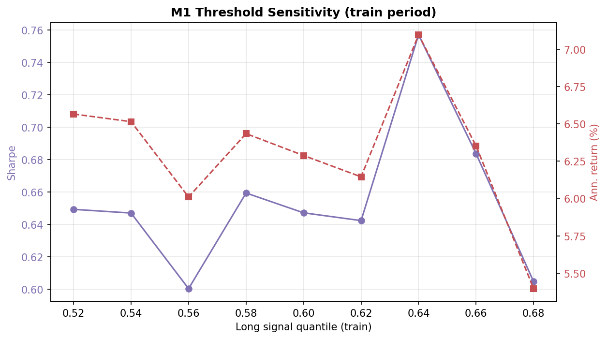

## Results: Long Only (no shorts)

`allow_short=False` — outputs in `data/backtests/long_only/`

### Full-Sample Strategy Metrics

These metrics cover the full effective panel, including train and test periods. They are useful for long-run behavior but should not be read as pure OOS performance.

| Strategy | Ann. Return | Ann. Volatility | Sharpe | Max Drawdown | Excess vs EW | Info Ratio | Weekly Hit Rate |
| --- | --- | --- | --- | --- | --- | --- | --- |
| Equal Weight (1/7) | 7.3625% | 12.8982% | 0.5708 | -39.4430% | 0.0000% | 0.0000 | 55.9838% |
| 60/40 Benchmark | 6.5640% | 13.2675% | 0.4947 | -43.1363% | -0.7984% | -0.2785 | 56.4909% |
| M1 Only | 7.3198% | 10.4263% | 0.7021 | -21.0040% | -0.0426% | -0.0413 | 58.8235% |
| M1 + M2 (Binary) | 7.1641% | 10.3440% | 0.6926 | -23.4770% | -0.1984% | -0.0609 | 58.8235% |
| M1 + M2 (Linear) | 1.7978% | 2.1391% | 0.8404 | -5.4396% | -5.5647% | -0.5465 | 58.9249% |
| M1 + M2 (ECDF) | 6.5142% | 7.1713% | 0.9084 | -18.8025% | -0.8483% | -0.1530 | 59.5335% |

### Test-Period Strategy Metrics

These metrics start at `2021-01-01` and are the cleanest portfolio-level OOS view in this report.

| Strategy | Ann. Return | Ann. Volatility | Sharpe | Max Drawdown | Excess vs EW | Info Ratio | Weekly Hit Rate |
| --- | --- | --- | --- | --- | --- | --- | --- |
| Equal Weight (1/7) | 7.3393% | 10.7090% | 0.6853 | -23.8984% | 0.0000% | 0.0000 | 54.3860% |
| 60/40 Benchmark | 5.1616% | 10.8912% | 0.4739 | -25.8267% | -2.1777% | -0.8578 | 53.6842% |
| M1 Only | 8.4044% | 10.6797% | 0.7869 | -21.0040% | 1.0651% | 0.2005 | 59.6491% |
| M1 + M2 (Binary) | 8.4044% | 10.6797% | 0.7869 | -21.0040% | 1.0651% | 0.2005 | 59.6491% |
| M1 + M2 (Linear) | 1.9244% | 2.2433% | 0.8579 | -4.7374% | -5.4149% | -0.6536 | 59.2982% |
| M1 + M2 (ECDF) | 6.9321% | 8.1433% | 0.8513 | -16.2947% | -0.4072% | -0.1122 | 59.6491% |

### Charts (Long Only (no shorts))

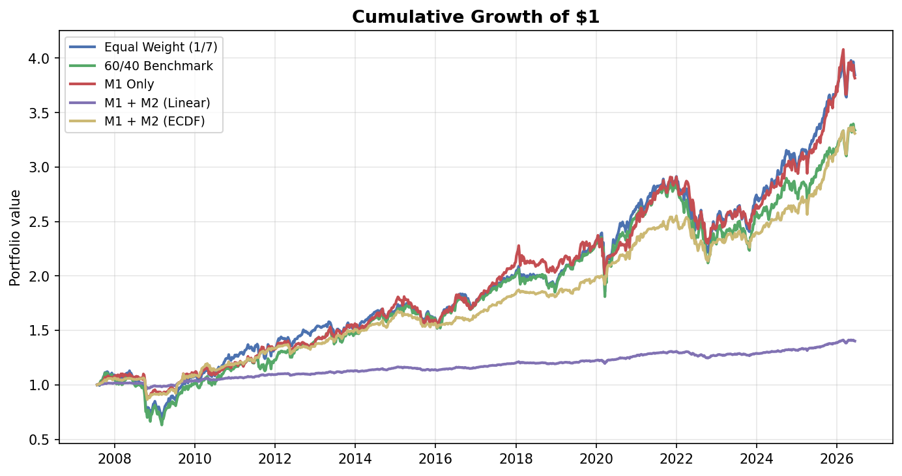

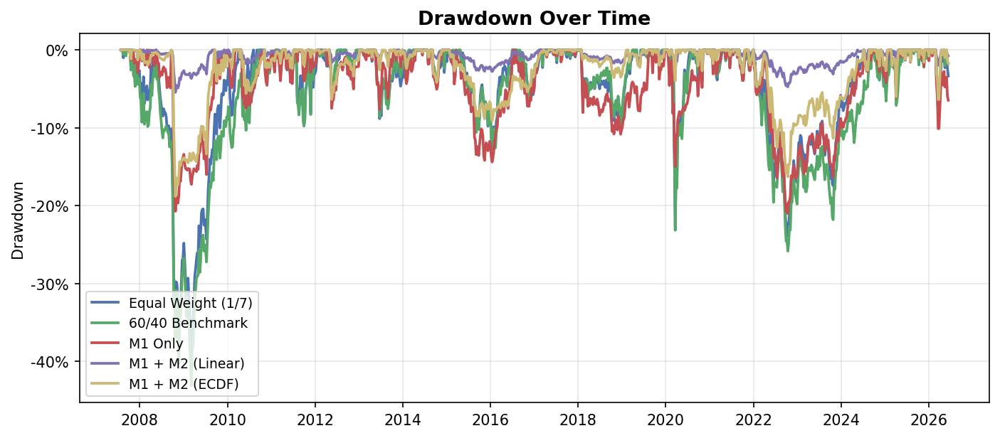

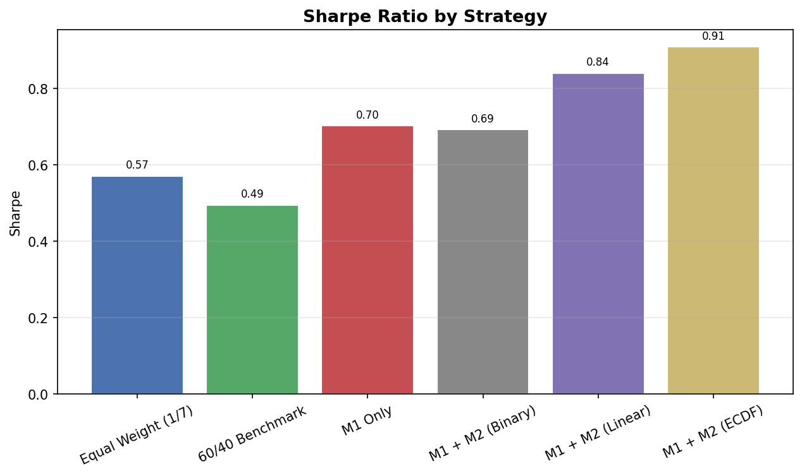

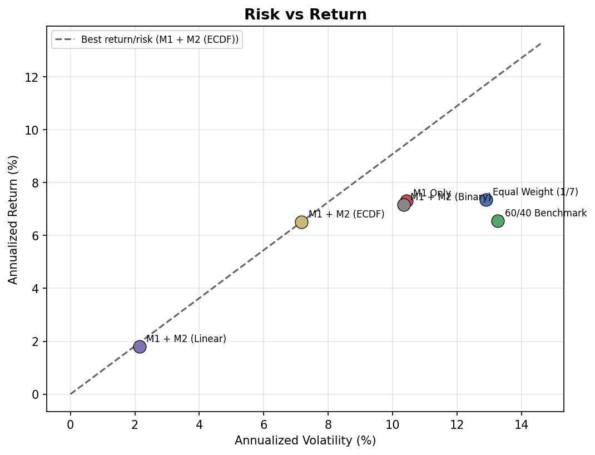

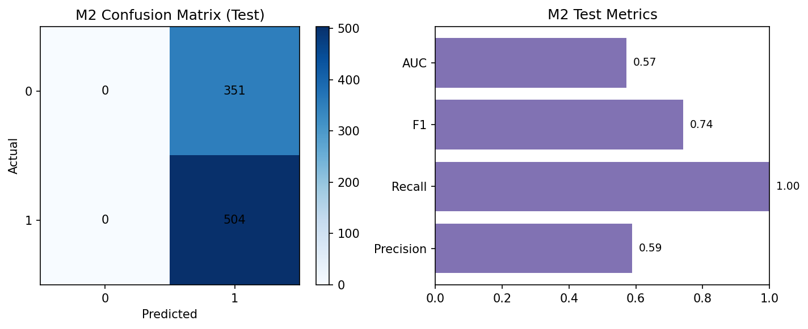


### M2 Quality — Long Only (no shorts) (Test Set)

| Metric | Value | Meaning |
| --- | --- | --- |
| Accuracy | 0.5895 | Share of correct meta-label predictions |
| Precision | 0.5895 | Approved trades that were actually profitable |
| Recall | 1.0000 | Profitable trades that M2 approved |
| F1 Score | 0.7417 | Balance of precision and recall |
| AUC | 0.5713 | Ranking quality of M2 probabilities |
| Brier Score | 0.2404 | Probability calibration error (lower is better) |
| Mean IC | 0.1061 | Spearman rank correlation of M1 scores vs forward returns |

## Results: Long / Short

`allow_short=True` — outputs in `data/backtests/long_short/`

### Full-Sample Strategy Metrics

These metrics cover the full effective panel, including train and test periods. They are useful for long-run behavior but should not be read as pure OOS performance.

| Strategy | Ann. Return | Ann. Volatility | Sharpe | Max Drawdown | Excess vs EW | Info Ratio | Weekly Hit Rate |
| --- | --- | --- | --- | --- | --- | --- | --- |
| Equal Weight (1/7) | 7.3625% | 12.8982% | 0.5708 | -39.4430% | 0.0000% | 0.0000 | 55.9838% |
| 60/40 Benchmark | 6.5640% | 13.2675% | 0.4947 | -43.1363% | -0.7984% | -0.2785 | 56.4909% |
| M1 Only | 1.4041% | 6.9145% | 0.2031 | -14.8093% | -5.9583% | -0.3971 | 51.8256% |
| M1 + M2 (Binary) | 2.4944% | 6.2918% | 0.3965 | -23.0807% | -4.8681% | -0.4840 | 29.9189% |
| M1 + M2 (Linear) | 0.6277% | 1.1238% | 0.5585 | -4.2153% | -6.7348% | -0.5987 | 57.0994% |
| M1 + M2 (ECDF) | 5.3393% | 6.8651% | 0.7777 | -11.0232% | -2.0231% | -0.2108 | 57.8093% |

### Test-Period Strategy Metrics

These metrics start at `2021-01-01` and are the cleanest portfolio-level OOS view in this report.

| Strategy | Ann. Return | Ann. Volatility | Sharpe | Max Drawdown | Excess vs EW | Info Ratio | Weekly Hit Rate |
| --- | --- | --- | --- | --- | --- | --- | --- |
| Equal Weight (1/7) | 7.3393% | 10.7090% | 0.6853 | -23.8984% | 0.0000% | 0.0000 | 54.3860% |
| 60/40 Benchmark | 5.1616% | 10.8912% | 0.4739 | -25.8267% | -2.1777% | -0.8578 | 53.6842% |
| M1 Only | 2.6697% | 5.6340% | 0.4738 | -9.1051% | -4.6697% | -0.4552 | 55.0877% |
| M1 + M2 (Binary) | 1.9426% | 8.1064% | 0.2396 | -23.0807% | -5.3968% | -0.8286 | 47.7193% |
| M1 + M2 (Linear) | 0.6238% | 1.4583% | 0.4278 | -4.2015% | -6.7156% | -0.7355 | 58.9474% |
| M1 + M2 (ECDF) | 5.2136% | 6.8177% | 0.7647 | -11.0232% | -2.1258% | -0.2830 | 59.6491% |

### Charts (Long / Short)

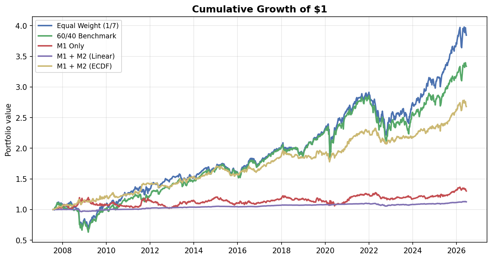

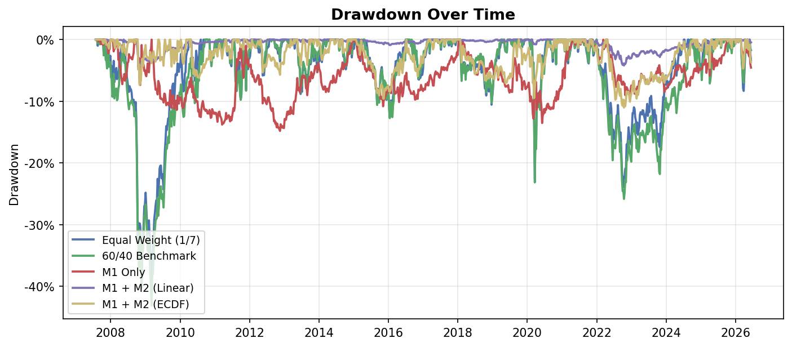

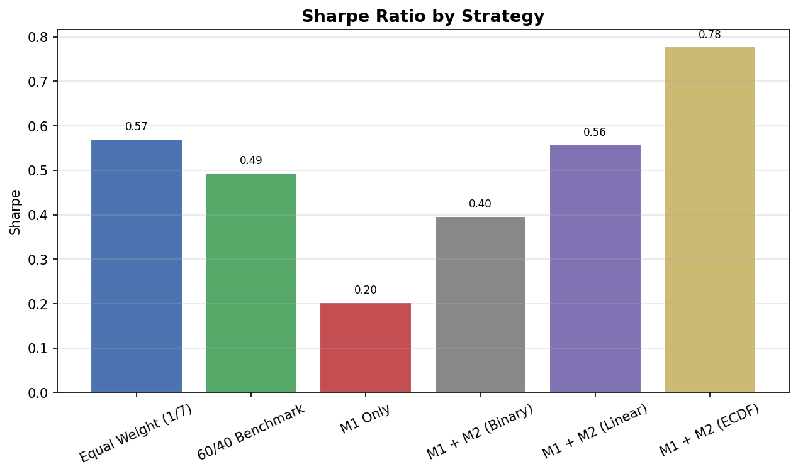

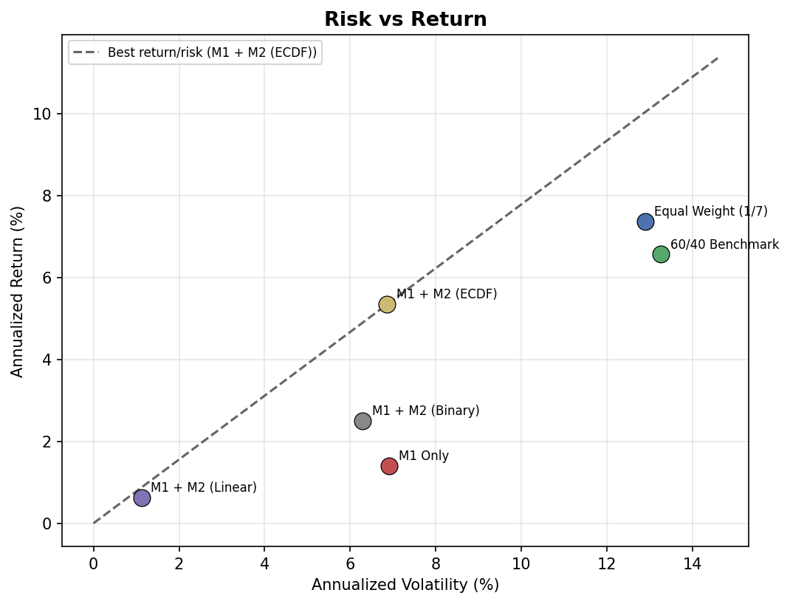

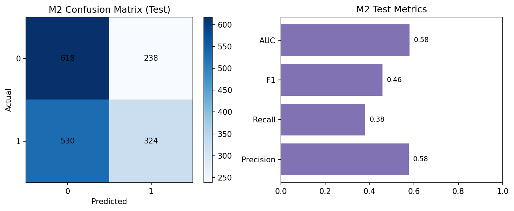


### M2 Quality — Long / Short (Test Set)

| Metric | Value | Meaning |
| --- | --- | --- |
| Accuracy | 0.5509 | Share of correct meta-label predictions |
| Precision | 0.5765 | Approved trades that were actually profitable |
| Recall | 0.3794 | Profitable trades that M2 approved |
| F1 Score | 0.4576 | Balance of precision and recall |
| AUC | 0.5796 | Ranking quality of M2 probabilities |
| Brier Score | 0.2466 | Probability calibration error (lower is better) |
| Mean IC | 0.1061 | Spearman rank correlation of M1 scores vs forward returns |

### How to read the metrics

| Metric | Interpretation |
| --- | --- |
| **Ann. Return** | Geometric average yearly portfolio return after transaction costs |
| **Ann. Volatility** | Standard deviation of weekly returns, scaled to a year |
| **Sharpe** | Return per unit of risk (higher is better; assumes 0% risk-free rate) |
| **Max Drawdown** | Largest peak-to-trough loss over the displayed period |
| **Excess vs EW** | Strategy return minus equal-weight benchmark return |
| **Info Ratio** | Consistency of outperformance vs equal-weight |
| **Weekly Hit Rate** | Fraction of weeks with positive net strategy return |

## Key Takeaways

1. **Long-only M1** avoids short exposure, which often hurts in upward-trending ETF samples.
2. **Long/short M1** can increase activity but shorts may reduce returns if poorly timed.
3. **M2 meta-labeling** adjusts position size on top of whichever M1 mode is used.
4. Compare both modes above to see whether shorts add value in this universe.

## Look-Ahead Controls

- Features use only data available at signal time (`shift(1)` on rolling windows)
- Macro series lagged 4 weeks to approximate release delay
- Strict chronological train/test split (train 2006-01-01–2020-12-31, test 2021-01-01–latest)

## Limitations

- yfinance and FRED are research-grade fallbacks, not institutional data
- Data provenance, ETL, validation, cache behavior, and fallback caveats are documented in `../DATA_SOURCES_AND_ETL.md`
- Past performance does not predict future results
